---
## Front matter
lang: ru-RU
title: "Лабораторная работа №3"
subtitle: "Дисциплина: Операционные системы"
author: 
  - Савостин Олег
institute:
  - Российский университет дружбы народов, Москва, Россия

## i18n babel
babel-lang: russian
babel-otherlangs: english

## Formatting pdf
toc: false
toc-title: Содержание
slide_level: 2
aspectratio: 169
section-titles: true
theme: metropolis
header-includes:
 - \metroset{progressbar=frametitle,sectionpage=progressbar,numbering=fraction}
---

# Информация

## Докладчик

:::::::::::::: {.columns align=center}
::: {.column width="70%"}

  * Савостин ОЛег
  * студент Физики-математического факультета, Математика и Механика.
  * Российский университет дружбы народов
  * [1032245472@pfur..ru](mailto:1032245472@pfur.ru)

:::
::::::::::::::

# Вводная часть

## Актуальность

- VirtualBox очень полезный инструмент для тех, кому комфортно пользоваться одной ОС, но надо использовать для работы другую ОС. Fedora Sway комфортная для программистов

## Цель работы

Целью работы является освоение Markdown

## Задание

1. Сделайте отчёт по предыдущей лабораторной работе в формате Markdown.
2. В качестве отчёта предоставить отчёты в 3 форматах: pdf md docx.

# Выполнение лабораторной работы

## Установка операционной системы

Я выбрал для установки Fedora Sway Virtualbox. Сперва, я устанавливаю ВиртуалБокс(уже заранее сделано) и устанавилваю .iso образ нужной мне версии Линукс Федора(рис. [-@fig:001]).

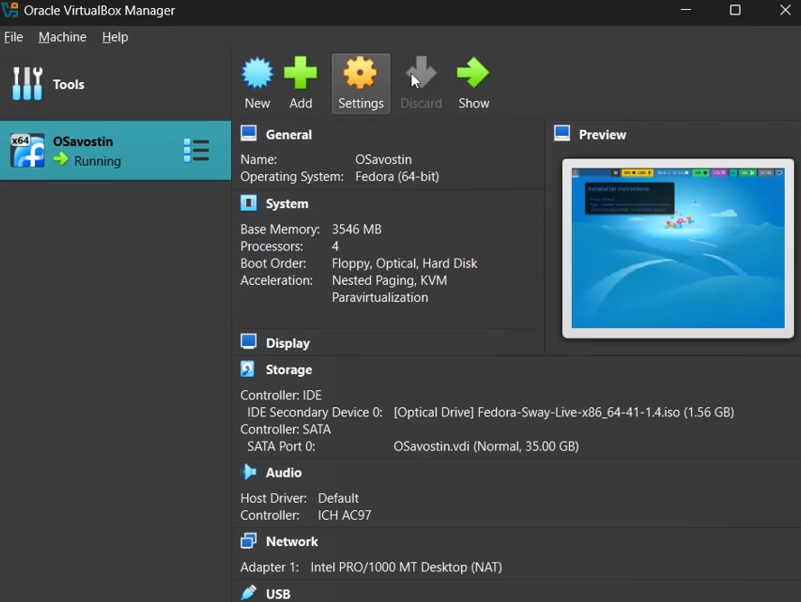{#fig:001 width=70%}

Затем, я вставливаю .iso образ в дисковод VirtualBox и запускаю виртуальную машину. (рис. [-@fig:002]).

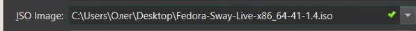{#fig:002 width=70%}

Прохожу через процесс установки операционной системы. Делаю пароль для пользователя root. Задаю название системы Savostin Oleg (osavostin) и начинаю установку Федоры Свэй(рис. [-@fig:003]) (рис. [-@fig:004]).

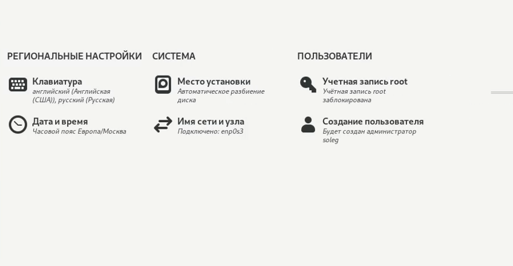{#fig:003 width=70%}

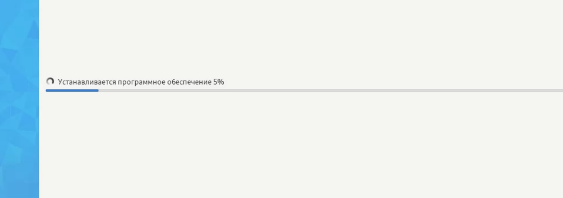{#fig:004 width=70%}

## Обновления, повышение комфорта работы, автоматическое обновление, отключение SELinux

После установки захожу в свой пользовательский аккаунт и открываю терминал с помощью комбинации Win+d и перехожу сразу в пользователя root(рис. [-@fig:005]).

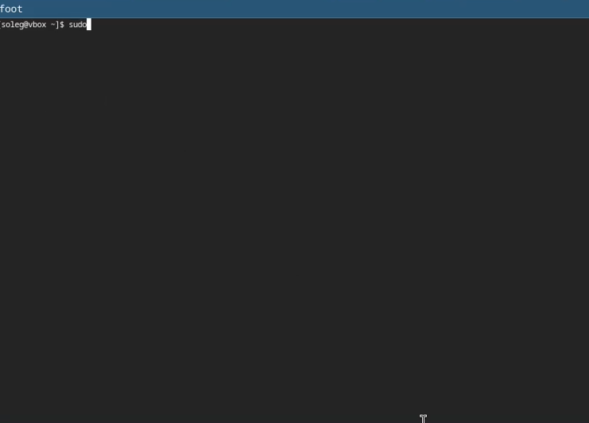{#fig:005 width=70%}

Затем, я устанавливаю средства разработки: sudo dnf -y group install development-tools. Обновляю пакеты: sudo dnf -y update(рис. [-@fig:006]).

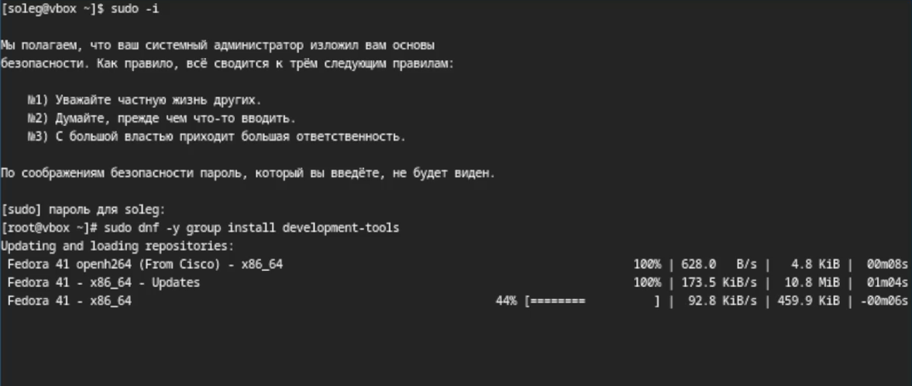{#fig:006 width=70%}

Для удобства я устанавливаю tmux (рис. [-@fig:007]).

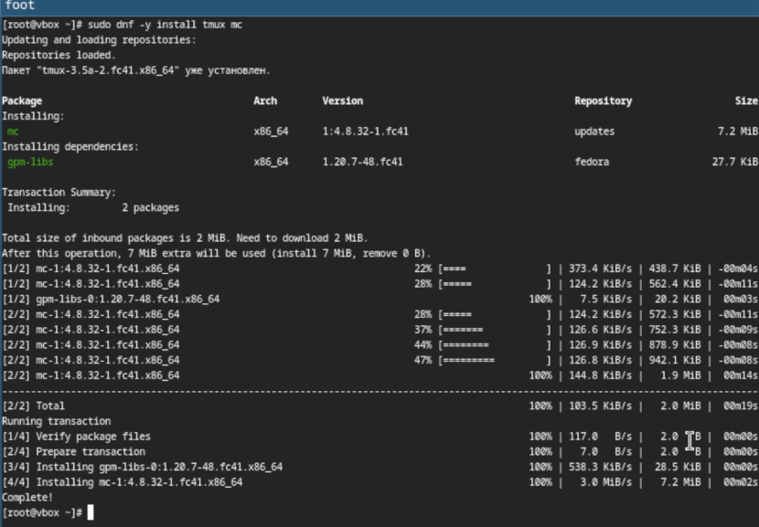{#fig:007 width=70%}

Теперь я ставлю автоматическое обновления программного обеспечения  и запускаю таймер (рис. [-@fig:008]).

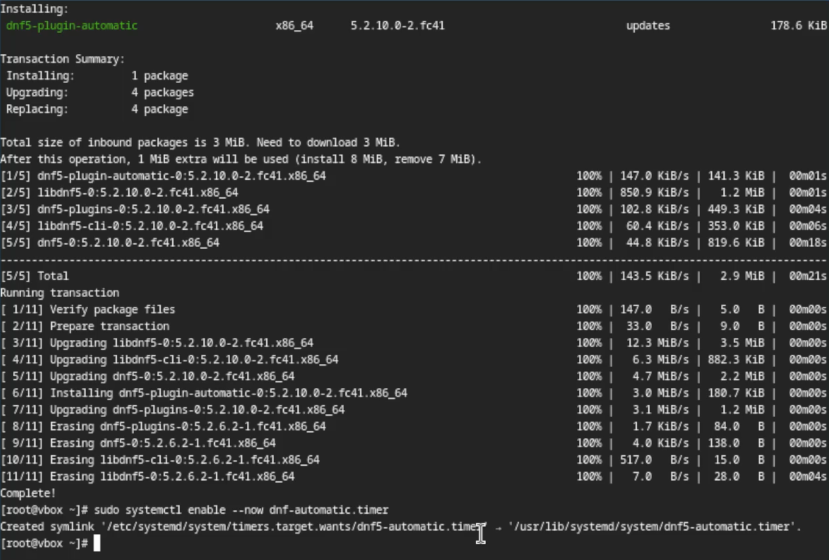{#fig:008 width=70%}

Так как я не буду пользоваться SELinux то я его выключаю следуя инструкциям (рис. [-@fig:009]).

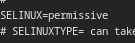{#fig:009 width=70%}

## Настройка логина пользователя.

Начиная с 5 лабораторной работы, логин пользователя будет верный и совпадать с логином пользователя в дем. классе. Захожу через супер-пользователя и создаю нового пользователя, задаю пароль и верный логин. (рис. [-@fig:010]).

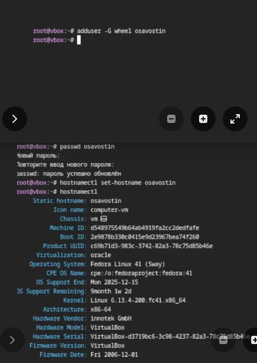{#fig:010 width=70%}

## Настройка раскладки клавиатуры

Захожу в ОС. Запускаю терминал и включаю tmux. Я создаю конфигурационный файл в нужной папке (рис. [-@fig:011]).

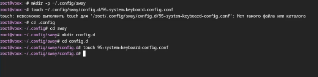{#fig:011 width=70%}

Редактирую конфигурационный файл. (рис. [-@fig:012]).

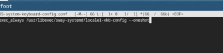{#fig:012 width=70%}

Переключаюсь на супер-пользователя и редактирую конфигурационный файл в Х11 (рис. [-@fig:013]).

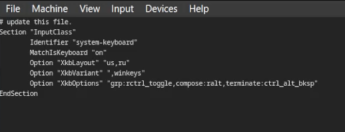{#fig:013 width=70%}

Перезапускаю виртуальную машину.

При установке виртуальной машины я задал имя пользователя верно и название хоста.

## Установка программного обеспечения для создания документации

Запускаю терминал, использую tmux и переключаюсь на супер-пользователя. Ввожу команду sudo dnf -y install pandoc, pandoc-crossref устанавливаю самостоятельно. (рис. [-@fig:014]).

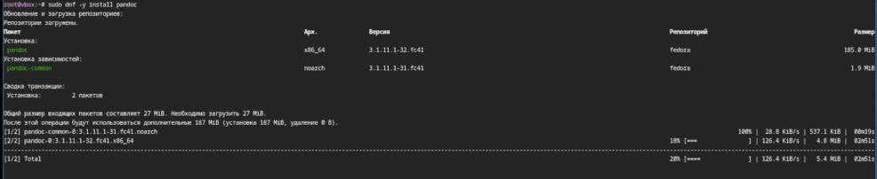{#fig:014 width=70%}

Устанавливаю texlive sudo dnf -y install texlive-scheme-full (рис. [-@fig:015]) (рис. [-@fig:016]).

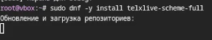{#fig:015 width=70%}

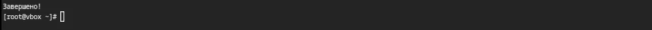{#fig:016 width=70%}

# Вывод

## Итог

В итоге данной работы я приобрел практические навыки установки операционной системы на виртуальную машину, настройки минимально необходимых для дальнейшей работы сервисов.

# Список литературы{.unnumbered}

Лабораторная работа по Операционным системам № 1

:::

