---
## Front matter
title: "Лабораторная работа №1"
subtitle: "Дисциплина: Операционные системы"
author: "Савостин Олег"

## Generic otions
lang: ru-RU
toc-title: "Содержание"

## Bibliography
bibliography: bib/cite.bib
csl: pandoc/csl/gost-r-7-0-5-2008-numeric.csl

## Pdf output format
toc: true # Table of contents
toc-depth: 2
lof: true # List of figures
lot: true # List of tables
fontsize: 12pt
linestretch: 1.5
papersize: a4
documentclass: scrreprt
## I18n polyglossia
polyglossia-lang:
  name: russian
  options:
	- spelling=modern
	- babelshorthands=true
polyglossia-otherlangs:
  name: english
## I18n babel
babel-lang: russian
babel-otherlangs: english
## Fonts
mainfont: IBM Plex Serif
romanfont: IBM Plex Serif
sansfont: IBM Plex Sans
monofont: IBM Plex Mono
mathfont: STIX Two Math
mainfontoptions: Ligatures=Common,Ligatures=TeX,Scale=0.94
romanfontoptions: Ligatures=Common,Ligatures=TeX,Scale=0.94
sansfontoptions: Ligatures=Common,Ligatures=TeX,Scale=MatchLowercase,Scale=0.94
monofontoptions: Scale=MatchLowercase,Scale=0.94,FakeStretch=0.9
mathfontoptions:
## Biblatex
biblatex: true
biblio-style: "gost-numeric"
biblatexoptions:
  - parentracker=true
  - backend=biber
  - hyperref=auto
  - language=auto
  - autolang=other*
  - citestyle=gost-numeric
## Pandoc-crossref LaTeX customization
figureTitle: "Рис."
tableTitle: "Таблица"
listingTitle: "Листинг"
lofTitle: "Список иллюстраций"
lotTitle: "Список таблиц"
lolTitle: "Листинги"
## Misc options
indent: true
header-includes:
  - \usepackage{indentfirst}
  - \usepackage{float} # keep figures where there are in the text
  - \floatplacement{figure}{H} # keep figures where there are in the text
---

# Цель работы

Целью данной работы является приобретение практических навыков установки операционной системы на виртуальную машину, настройки минимально необходимых для дальнейшей работы сервисов.

# Задание

1. Установка Linux на Virtualbox
2. Обновления, повышение комфорта работы, автоматическое обновление, отключение SELinux
3. Настройка логина пользователя
4. Настройка раскладки клавиатуры
5. Установка программного обеспечения для создания документации

# Теоретическое введение

    Лабораторная работа подразумевает установку на виртуальную машину VirtualBox (https://www.virtualbox.org/) операционной системы Linux (дистрибутив Fedora).
    Выполнение работы возможно как в дисплейном классе факультета физико-математических и естественных наук РУДН, так и дома. Описание выполнения работы приведено для дисплейного класса со следующими характеристиками техники:
        Intel Core i3-550 3.2 GHz, 4 GB оперативной памяти, 80 GB свободного места на жёстком диске;
        ОС Linux Gentoo (http://www.gentoo.ru/);
        VirtualBox версии 7.0 или новее.
    Для установки в виртуальную машину используется дистрибутив Linux Fedora (https://getfedora.org), вариант с менеджером окон sway (https://fedoraproject.org/spins/sway/).
    При выполнении лабораторной работы на своей технике вам необходимо скачать необходимый образ операционной системы (https://fedoraproject.org/spins/sway/download/index.html).
    В дисплейных классах можно воспользоваться образом в каталоге /afs/dk.sci.pfu.edu.ru/common/files/iso.
    Для определённости в описании будем использовать версию Fedora-Sway-Live-x86_64-41-1.4.iso.

# Выполнение лабораторной работы

## Установка операционной системы

Я выбрал для установки Fedora Sway Virtualbox. Сперва, я устанавливаю ВиртуалБокс(уже заранее сделано) и устанавилваю .iso образ нужной мне версии Линукс Федора(рис. [-@fig:001]).

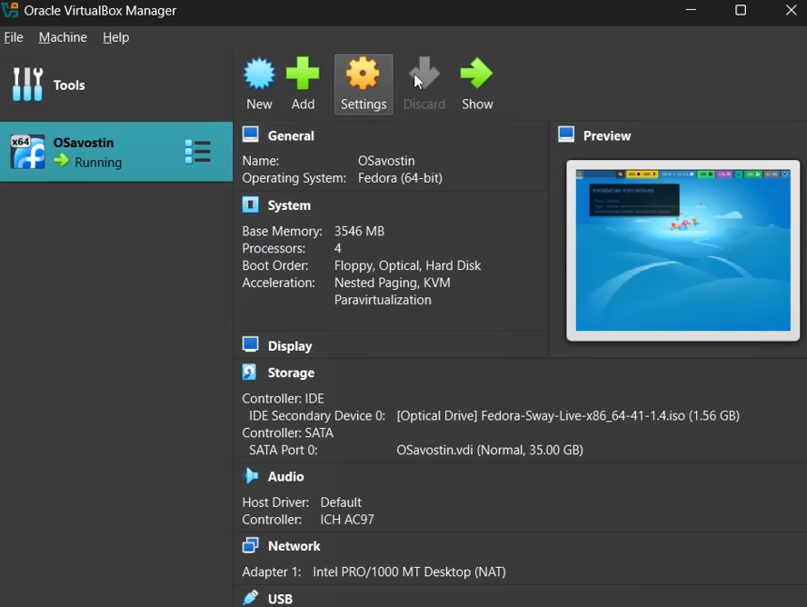{#fig:001 width=70%}

Затем, я вставливаю .iso образ в дисковод VirtualBox и запускаю виртуальную машину. (рис. [-@fig:002]).

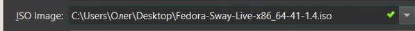{#fig:002 width=70%}

Прохожу через процесс установки операционной системы. Делаю пароль для пользователя root. Задаю название системы Savostin Oleg (osavostin) и начинаю установку Федоры Свэй(рис. [-@fig:003]) (рис. [-@fig:004]).

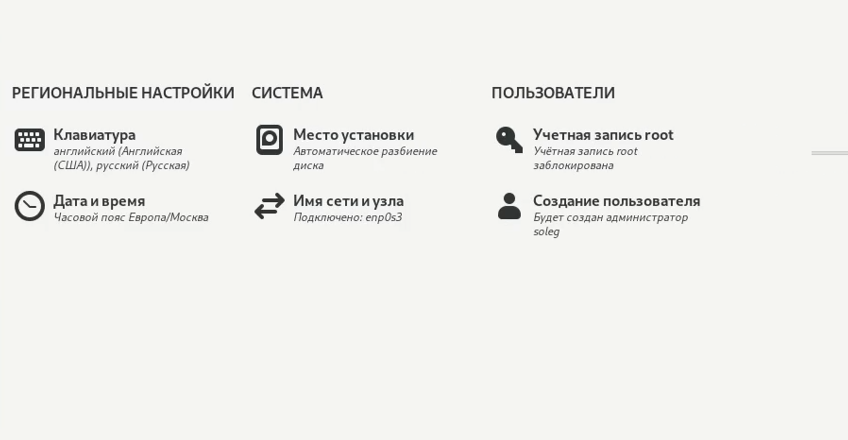{#fig:003 width=70%}

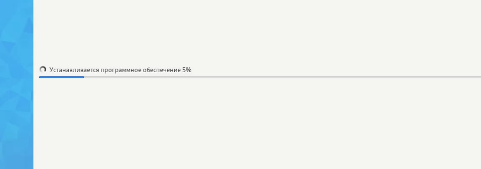{#fig:004 width=70%}

## Обновления, повышение комфорта работы, автоматическое обновление, отключение SELinux

После установки захожу в свой пользовательский аккаунт и открываю терминал с помощью комбинации Win+d и перехожу сразу в пользователя root(рис. [-@fig:005]).

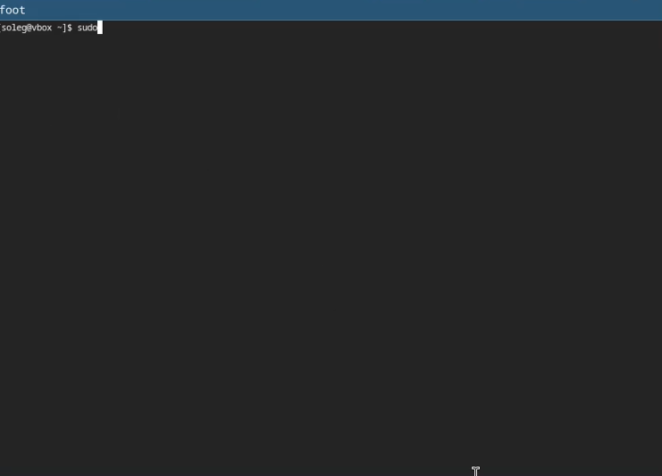{#fig:005 width=70%}

Затем, я устанавливаю средства разработки: sudo dnf -y group install development-tools. Обновляю пакеты: sudo dnf -y update(рис. [-@fig:006]).

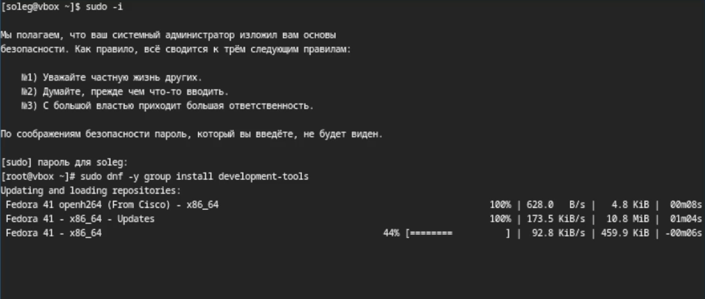{#fig:006 width=70%}

Для удобства я устанавливаю tmux (рис. [-@fig:007]).

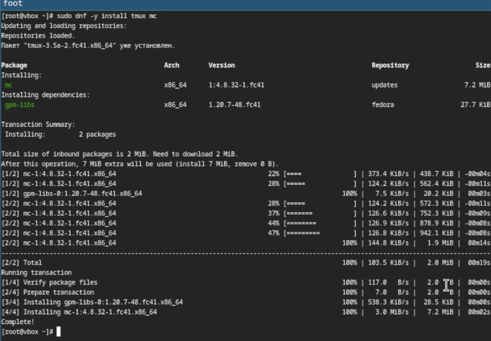{#fig:007 width=70%}

Теперь я ставлю автоматическое обновления программного обеспечения  и запускаю таймер (рис. [-@fig:008]).

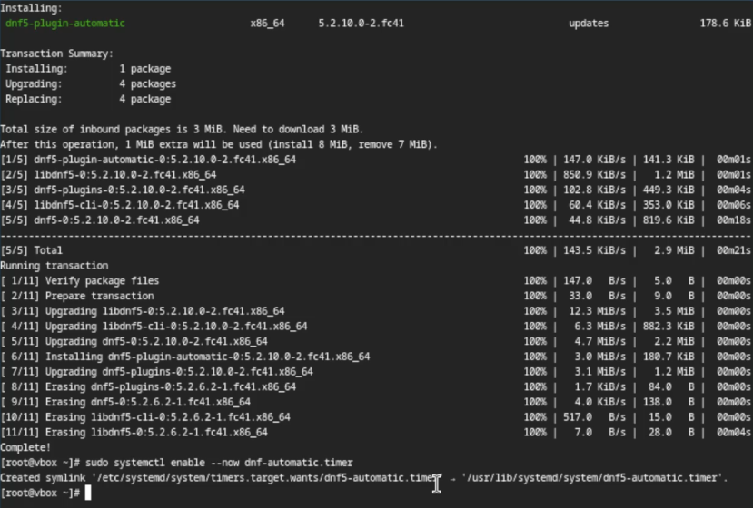{#fig:008 width=70%}

Так как я не буду пользоваться SELinux то я его выключаю следуя инструкциям (рис. [-@fig:009]).

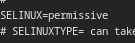{#fig:009 width=70%}

## Настройка логина пользователя.

Начиная с 5 лабораторной работы, логин пользователя будет верный и совпадать с логином пользователя в дем. классе. Захожу через супер-пользователя и создаю нового пользователя, задаю пароль и верный логин. (рис. [-@fig:010]).

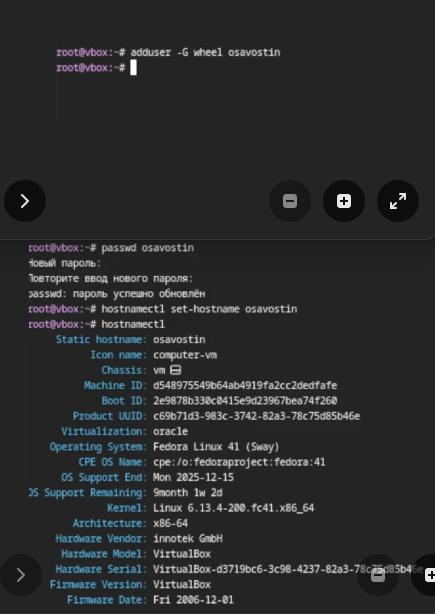{#fig:010 width=70%}

## Настройка раскладки клавиатуры

Захожу в ОС. Запускаю терминал и включаю tmux. Я создаю конфигурационный файл в нужной папке (рис. [-@fig:011]).

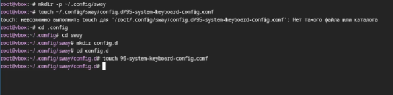{#fig:011 width=70%}

Редактирую конфигурационный файл. (рис. [-@fig:012]).

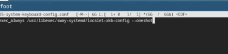{#fig:012 width=70%}

Переключаюсь на супер-пользователя и редактирую конфигурационный файл в Х11 (рис. [-@fig:013]).

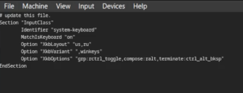{#fig:013 width=70%}

Перезапускаю виртуальную машину.

При установке виртуальной машины я задал имя пользователя верно и название хоста.

## Установка программного обеспечения для создания документации

Запускаю терминал, использую tmux и переключаюсь на супер-пользователя. Ввожу команду sudo dnf -y install pandoc, pandoc-crossref устанавливаю самостоятельно. (рис. [-@fig:014]).

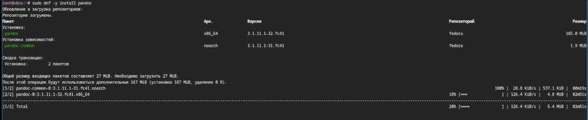{#fig:014 width=70%}

Устанавливаю texlive sudo dnf -y install texlive-scheme-full (рис. [-@fig:015]) (рис. [-@fig:016]).

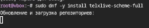{#fig:015 width=70%}

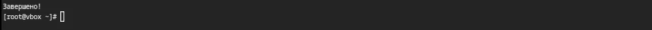{#fig:016 width=70%}

## Домашнее задание и контрольные вопросы.

Какую информацию содержит учётная запись пользователя? Учетная запись содержит сведения, позволяющие компьютеру распознать пользователя

Укажите команды терминала и приведите примеры:
        для получения справки по команде; 
    --help pandoc --help
        для перемещения по файловой системе; 
    cd cd /
        для просмотра содержимого каталога; 
    ls 
        для определения объёма каталога; 
    du -hs
        для создания / удаления каталогов / файлов;
    mkdir rmdir - Каталоги
    touch rm - файлы
        для задания определённых прав на файл / каталог;
    chmod
        для просмотра истории команд.
    pgup pgdn (Клавиши вверх и вниз)
Что такое файловая система? Приведите примеры с краткой характеристикой.
Файловая система - это структура, используемая операционной системой для организации управления . Пример NFTS
Как посмотреть, какие файловые системы подмонтированы в ОС? файлами в хранилище
findmnt
Как удалить зависший процесс?
Ctrl+Shift+Esc

# Выводы

В итоге данной работы я приобрел практические навыки установки операционной системы на виртуальную машину, настройки минимально необходимых для дальнейшей работы сервисов.

# Список литературы{.unnumbered}

Лабораторная работа по Операционным системам № 1

::: {#refs}
:::
