---
## Front matter
lang: ru-RU
title: "Лабораторная работа №2"
subtitle: "Дисциплина: Операционные системы"
author: 
  - Савостин Олег
institute:
  - Российский университет дружбы народов, Москва, Россия

## i18n babel
babel-lang: russian
babel-otherlangs: english

## Formatting pdf
toc: false
toc-title: Содержание
slide_level: 2
aspectratio: 169
section-titles: true
theme: metropolis
header-includes:
 - \metroset{progressbar=frametitle,sectionpage=progressbar,numbering=fraction}
---

# Информация

## Докладчик

:::::::::::::: {.columns align=center}
::: {.column width="70%"}

  * Савостин Олег
  * студент Физики-математического факультета, Математика и Механика.
  * Российский университет дружбы народов
  * [1032245472@pfur..ru](mailto:1032245472@pfur.ru)

:::
::::::::::::::

# Вводная часть

## Актуальность

- GitHub очень актуальна среди программистов.

## Цели и задачи

- Изучить идеологию и применение средств контроля версий и освоить умения по работе с git.

# Задание

1. Установка программного обеспечения
2. Базовая настройка git
3. Создайте ключи ssh
4. Создайте ключи pgp
5. Настройка github
6. Добавление PGP ключа в GitHub
7. Настройка автоматических подписей коммитов git
8. Настройка gh
9. Шаблон для рабочего пространства

# Выполнение лабораторной работы

## Установка программного обеспечения

В первую очередь, устанавливаем git и gh(рис. [-@fig:001]).

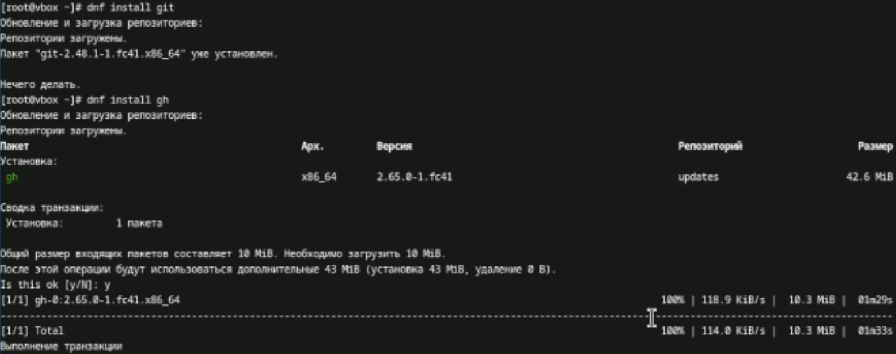{#fig:001 width=70%}

## Базовая настройка git

Задаю имя и почту владельца репозитория. Так как у меня уже есть аккаунт на github'e, то я задаю данные, которые я вводил когда создавал аккаунт(рис. [-@fig:002]).

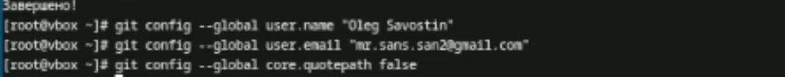{#fig:002 width=70%}

Настраиваю utf-8 в выводе сообщений гит, настраиваю верификацию и подписание коммитов git(рис. [-@fig:003]) (рис. [-@fig:004]).

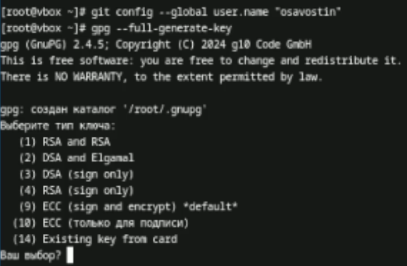{#fig:003 width=70%}

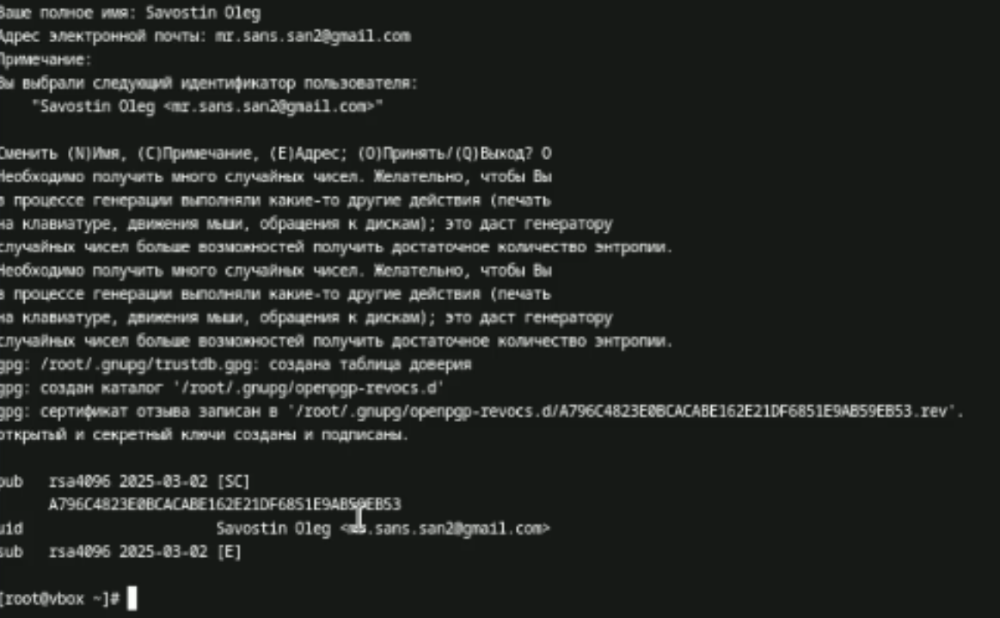{#fig:004 width=70%}

Записываю параметры autocrlf safecrl(рис. [-@fig:005]).

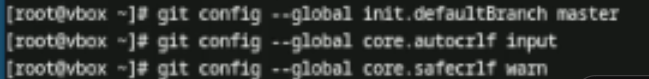{#fig:005 width=70%}

## Создайте ключи ssh

По алгоритму rsa с ключём размером 4096 создаю ключ. Также создаю ключ по алгоритму ed25519(рис. [-@fig:006]).

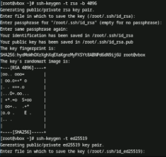{#fig:006 width=70%}

## Создайте ключи pgp

Следуя инструкциям, указанных в лабораторной работе, создаю ключ gpg  gpg --full-generate-key (рис. [-@fig:007]).

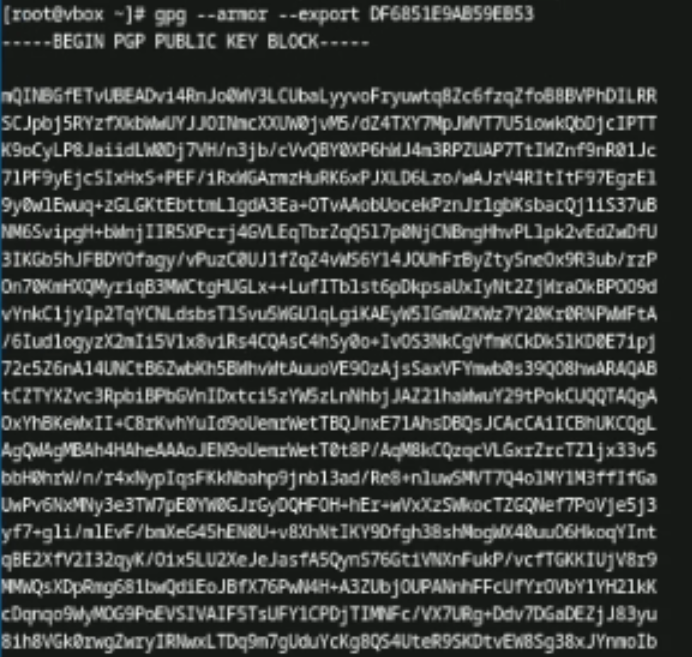{#fig:007 width=70%}

## Настройка github

Аккаунт заранее существовал с первого семестра. (рис. [-@fig:008]).

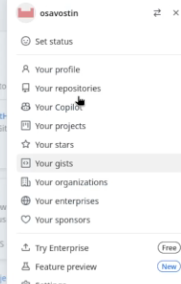{#fig:008 width=70%}

## Добавление PGP ключа в GitHub

Вывожу список ключей и копирую отпечаток приватного ключа командой gpg --list-secret-keys --keyid-format LONG (рис. [-@fig:009]).

{#fig:009 width=70%}

Копирую отпечаток ключа и вставляю его в настройки GitHub (рис. [-@fig:010]).

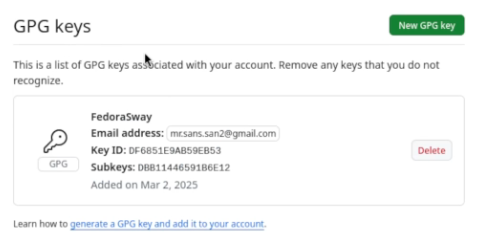{#fig:010 width=70%}

## Настройка автоматических подписей коммитов git

Используя введённый email, указываю Гит применять его при подписи коммитов (рис. [-@fig:011]).

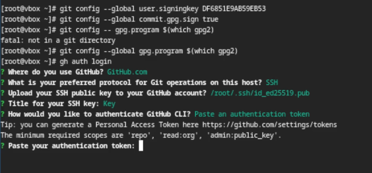{#fig:011 width=70%}

## Настройка gh

Для пользованием gh я захожу в свой аккаунт через терминал (рис. [-@fig:012]).

{#fig:012 width=70%}

## Шаблон для рабочего пространства

Теперь необходимо создать шаблон рабочего пространства. Пишу в терминал следующие команды:
mkdir -p ~/work/study/2022-2023/"Операционные системы"
cd ~/work/study/2022-2023/"Операционные системы"
gh repo create study_2022-2023_os-intro --template=yamadharma/course-directory-student-template --public
git clone --recursive git@github.com:<owner>/study_2022-2023_os-intro.git os-intro (рис. [-@fig:013]).

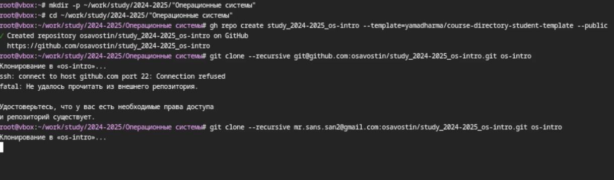{#fig:013 width=70%}

Перехожу в каталог курса и удаляю лишние файлы .json и затем создаю нужные каталоги (рис. [-@fig:014]) (рис. [-@fig:015]).

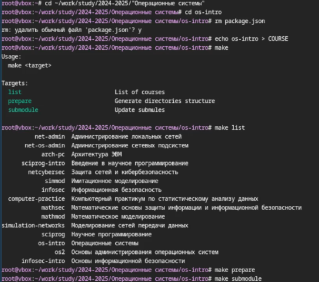{#fig:014 width=70%}

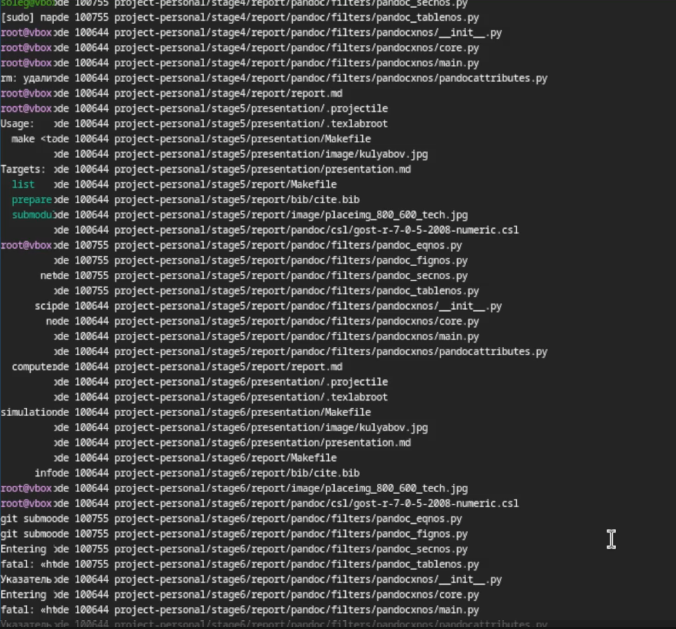{#fig:015 width=70%}

Успешно отправляю файлы на сервер (рис. [-@fig:015]).

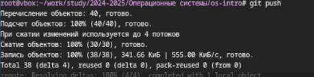{#fig:015 width=70%}

# Выводы

В ходе проделанной работы я изучил идеологию и применение средств контроля версий и освоил умения по работе с git.

# Список литературы{.unnumbered}

Лабораторная работа №2

:::

