---
## Front matter
title: "Лабораторная работа №2"
subtitle: "Дисциплина: Операционные системы"
author: "Савостин Олег"

## Generic otions
lang: ru-RU
toc-title: "Содержание"

## Bibliography
bibliography: bib/cite.bib
csl: pandoc/csl/gost-r-7-0-5-2008-numeric.csl

## Pdf output format
toc: true # Table of contents
toc-depth: 2
lof: true # List of figures
lot: true # List of tables
fontsize: 12pt
linestretch: 1.5
papersize: a4
documentclass: scrreprt
## I18n polyglossia
polyglossia-lang:
  name: russian
  options:
	- spelling=modern
	- babelshorthands=true
polyglossia-otherlangs:
  name: english
## I18n babel
babel-lang: russian
babel-otherlangs: english
## Fonts
mainfont: IBM Plex Serif
romanfont: IBM Plex Serif
sansfont: IBM Plex Sans
monofont: IBM Plex Mono
mathfont: STIX Two Math
mainfontoptions: Ligatures=Common,Ligatures=TeX,Scale=0.94
romanfontoptions: Ligatures=Common,Ligatures=TeX,Scale=0.94
sansfontoptions: Ligatures=Common,Ligatures=TeX,Scale=MatchLowercase,Scale=0.94
monofontoptions: Scale=MatchLowercase,Scale=0.94,FakeStretch=0.9
mathfontoptions:
## Biblatex
biblatex: true
biblio-style: "gost-numeric"
biblatexoptions:
  - parentracker=true
  - backend=biber
  - hyperref=auto
  - language=auto
  - autolang=other*
  - citestyle=gost-numeric
## Pandoc-crossref LaTeX customization
figureTitle: "Рис."
tableTitle: "Таблица"
listingTitle: "Листинг"
lofTitle: "Список иллюстраций"
lotTitle: "Список таблиц"
lolTitle: "Листинги"
## Misc options
indent: true
header-includes:
  - \usepackage{indentfirst}
  - \usepackage{float} # keep figures where there are in the text
  - \floatplacement{figure}{H} # keep figures where there are in the text
---

# Цель работы

Изучить идеологию и применение средств контроля версий и освоить умения по работе с git.

# Задание

1. Установка программного обеспечения
2. Базовая настройка git
3. Создайте ключи ssh
4. Создайте ключи pgp
5. Настройка github
6. Добавление PGP ключа в GitHub
7. Настройка автоматических подписей коммитов git
8. Настройка gh
9. Шаблон для рабочего пространства
# Теоретическое введение

Системы контроля версий (Version Control System, VCS) применяются при работе нескольких человек над одним проектом. Обычно основное дерево проекта хранится в локальном или удалённом репозитории, к которому настроен доступ для участников проекта. При внесении изменений в содержание проекта система контроля версий позволяет их фиксировать, совмещать изменения, произведённые разными участниками проекта, производить откат к любой более ранней версии проекта, если это требуется.

В классических системах контроля версий используется централизованная модель, предполагающая наличие единого репозитория для хранения файлов. Выполнение большинства функций по управлению версиями осуществляется специальным сервером. Участник проекта (пользователь) перед началом работы посредством определённых команд получает нужную ему версию файлов. После внесения изменений, пользователь размещает новую версию в хранилище. При этом предыдущие версии не удаляются из центрального хранилища и к ним можно вернуться в любой момент. Сервер может сохранять не полную версию изменённых файлов, а производить так называемую дельта-компрессию — сохранять только изменения между последовательными версиями, что позволяет уменьшить объём хранимых данных.

Системы контроля версий поддерживают возможность отслеживания и разрешения конфликтов, которые могут возникнуть при работе нескольких человек над одним файлом. Можно объединить (слить) изменения, сделанные разными участниками (автоматически или вручную), вручную выбрать нужную версию, отменить изменения вовсе или заблокировать файлы для изменения. В зависимости от настроек блокировка не позволяет другим пользователям получить рабочую копию или препятствует изменению рабочей копии файла средствами файловой системы ОС, обеспечивая таким образом, привилегированный доступ только одному пользователю, работающему с файлом.

Системы контроля версий также могут обеспечивать дополнительные, более гибкие функциональные возможности. Например, они могут поддерживать работу с несколькими версиями одного файла, сохраняя общую историю изменений до точки ветвления версий и собственные истории изменений каждой ветви. Кроме того, обычно доступна информация о том, кто из участников, когда и какие изменения вносил. Обычно такого рода информация хранится в журнале изменений, доступ к которому можно ограничить.

В отличие от классических, в распределённых системах контроля версий центральный репозиторий не является обязательным.

Среди классических VCS наиболее известны CVS, Subversion, а среди распределённых — Git, Bazaar, Mercurial. Принципы их работы схожи, отличаются они в основном синтаксисом используемых в работе команд.

# Выполнение лабораторной работы

## Установка программного обеспечения

В первую очередь, устанавливаем git и gh(рис. [-@fig:001]).

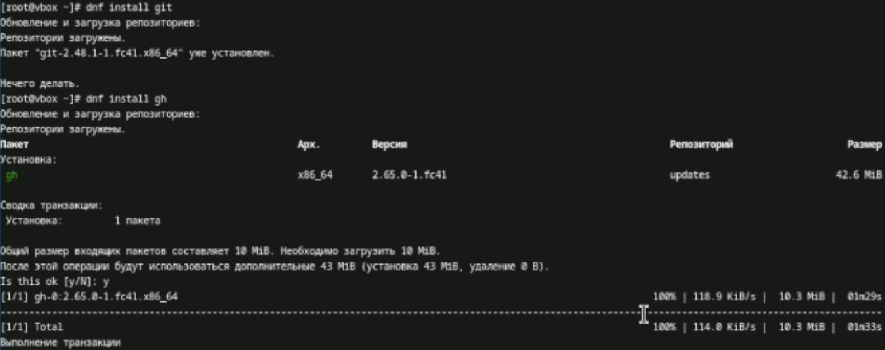{#fig:001 width=70%}

## Базовая настройка git

Задаю имя и почту владельца репозитория. Так как у меня уже есть аккаунт на github'e, то я задаю данные, которые я вводил когда создавал аккаунт(рис. [-@fig:002]).

{#fig:002 width=70%}

Настраиваю utf-8 в выводе сообщений гит, настраиваю верификацию и подписание коммитов git(рис. [-@fig:003]) (рис. [-@fig:004]).

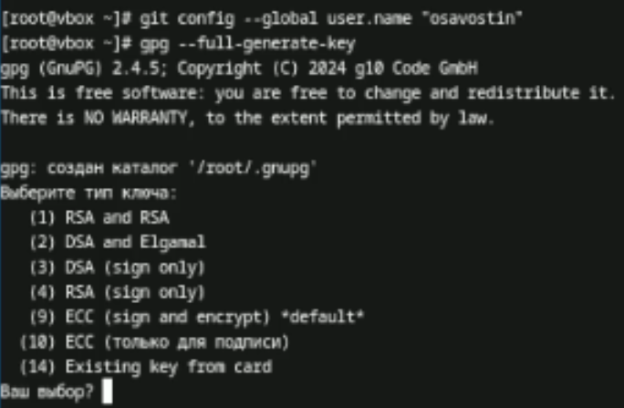{#fig:003 width=70%}

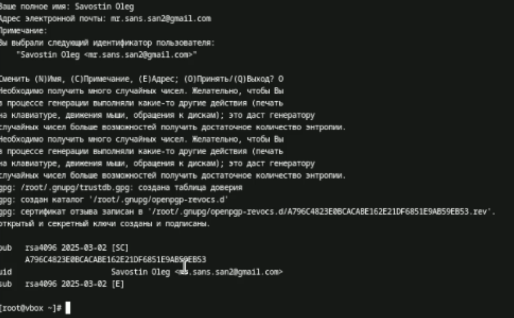{#fig:004 width=70%}

Записываю параметры autocrlf safecrl(рис. [-@fig:005]).

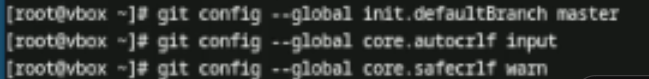{#fig:005 width=70%}

## Создайте ключи ssh

По алгоритму rsa с ключём размером 4096 создаю ключ. Также создаю ключ по алгоритму ed25519(рис. [-@fig:006]).

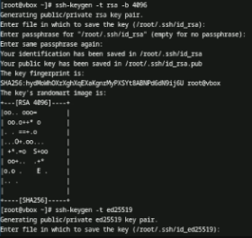{#fig:006 width=70%}

## Создайте ключи pgp

Следуя инструкциям, указанных в лабораторной работе, создаю ключ gpg  gpg --full-generate-key (рис. [-@fig:007]).

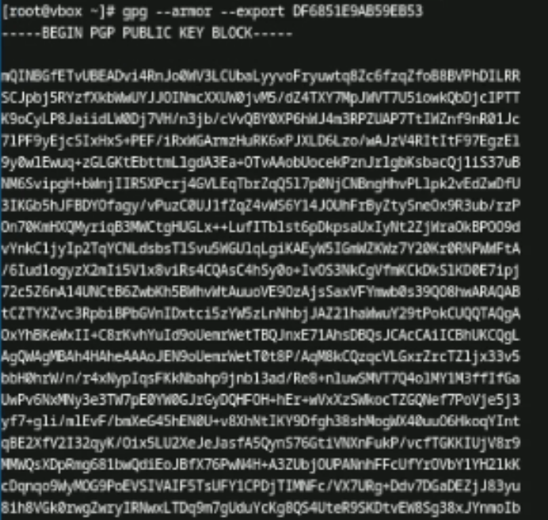{#fig:007 width=70%}

## Настройка github

Аккаунт заранее существовал с первого семестра. (рис. [-@fig:008]).

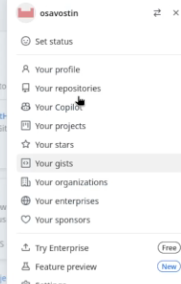{#fig:008 width=70%}

## Добавление PGP ключа в GitHub

Вывожу список ключей и копирую отпечаток приватного ключа командой gpg --list-secret-keys --keyid-format LONG (рис. [-@fig:009]).

{#fig:009 width=70%}

Копирую отпечаток ключа и вставляю его в настройки GitHub (рис. [-@fig:010]).

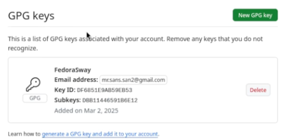{#fig:010 width=70%}

## Настройка автоматических подписей коммитов git

Используя введённый email, указываю Гит применять его при подписи коммитов (рис. [-@fig:011]).

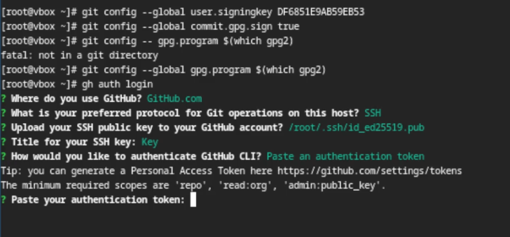{#fig:011 width=70%}

## Настройка gh

Для пользованием gh я захожу в свой аккаунт через терминал (рис. [-@fig:012]).

{#fig:012 width=70%}

## Шаблон для рабочего пространства

Теперь необходимо создать шаблон рабочего пространства. Пишу в терминал следующие команды:
mkdir -p ~/work/study/2022-2023/"Операционные системы"
cd ~/work/study/2022-2023/"Операционные системы"
gh repo create study_2022-2023_os-intro --template=yamadharma/course-directory-student-template --public
git clone --recursive git@github.com:<owner>/study_2022-2023_os-intro.git os-intro (рис. [-@fig:013]).

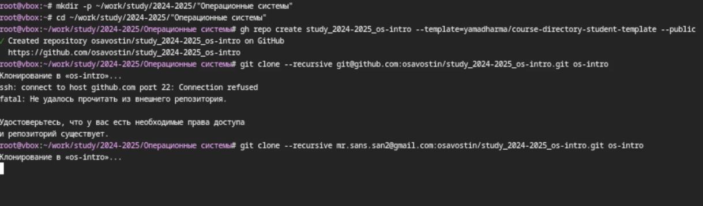{#fig:013 width=70%}

Перехожу в каталог курса и удаляю лишние файлы .json и затем создаю нужные каталоги (рис. [-@fig:014]) (рис. [-@fig:015]).

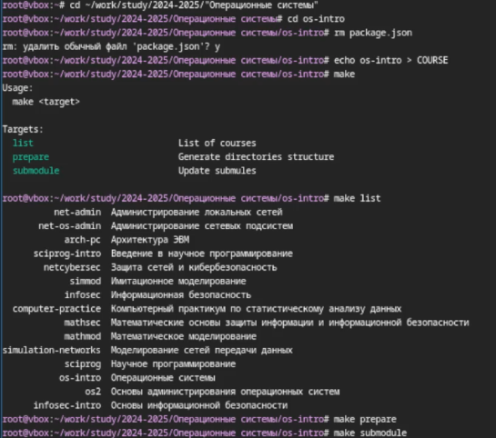{#fig:014 width=70%}

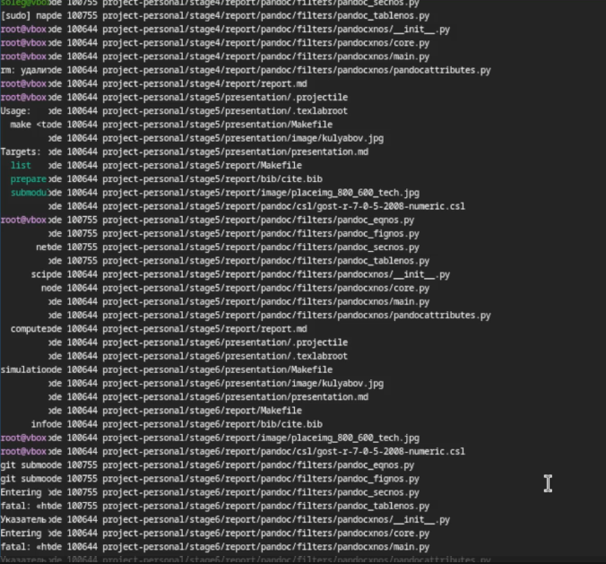{#fig:015 width=70%}

Успешно отправляю файлы на сервер (рис. [-@fig:016]).

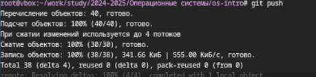{#fig:016 width=70%}

# Выводы

В ходе проделанной работы я изучил идеологию и применение средств контроля версий и освоил умения по работе с git.

# Список литературы{.unnumbered}

Лабораторная работа №2

::: {#refs}
:::
