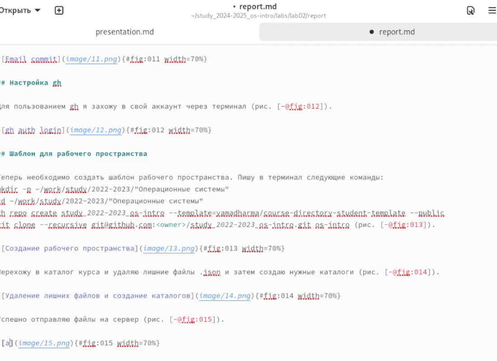
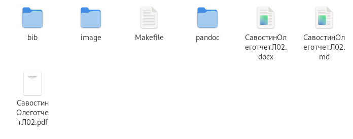

---
## Front matter
lang: ru-RU
title: "Лабораторная работа №3"
subtitle: "Дисциплина: Операционные системы"
author: 
  - Савостин Олег
institute:
  - Российский университет дружбы народов, Москва, Россия

## i18n babel
babel-lang: russian
babel-otherlangs: english

## Formatting pdf
toc: false
toc-title: Содержание
slide_level: 2
aspectratio: 169
section-titles: true
theme: metropolis
header-includes:
 - \metroset{progressbar=frametitle,sectionpage=progressbar,numbering=fraction}
---

# Информация

## Докладчик

:::::::::::::: {.columns align=center}
::: {.column width="70%"}

  * Савостин Олег
  * студент Физики-математического факультета, Математика и Механика.
  * Российский университет дружбы народов
  * [1032245472@pfur..ru](mailto:1032245472@pfur.ru)

:::
::::::::::::::

# Вводная часть

# Цель работы

Целью работы является освоение Markdown

# Задание

1. Сделайте отчёт по предыдущей лабораторной работе в формате Markdown.
2. В качестве отчёта предоставить отчёты в 3 форматах: pdf md docx.

# Выполнение лабораторной работы

## Сделайте отчёт по предыдущей лабораторной работе в формате Markdown.

Оформляю предыдущую лабораторную работу в формате .md (рис. [-@fig:001]).

{#fig:001 width=70%}

## В качестве отчёта предоставить отчёты в 3 форматах: pdf md docx.

С помощью make форматирую этот файл в два разных формата(рис. [-@fig:002]).

{#fig:002 width=70%}

# Выводы

В ходе работы я приобрел навыки с работой Markdown

# Список литературы{.unnumbered}

Лабораторная работа №3

