---
## Front matter
lang: ru-RU
title: "Лабораторная работа №3"
subtitle: "Дисциплина: Операционные системы"
author: 
  - Савостин Олег
institute:
  - Российский университет дружбы народов, Москва, Россия

## i18n babel
babel-lang: russian
babel-otherlangs: english

## Formatting pdf
toc: false
toc-title: Содержание
slide_level: 2
aspectratio: 169
section-titles: true
theme: metropolis
header-includes:
 - \metroset{progressbar=frametitle,sectionpage=progressbar,numbering=fraction}
---

# Информация

## Докладчик

:::::::::::::: {.columns align=center}
::: {.column width="70%"}

  * Савостин Олег
  * студент Физики-математического факультета, Математика и Механика.
  * Российский университет дружбы народов
  * [1032245472@pfur..ru](mailto:1032245472@pfur.ru)

:::
::::::::::::::

# Вводная часть

## Актуальность

- Важно донести результаты своих исследований до окружающих
- Научная презентация --- рабочий инструмент исследователя
- Необходимо создавать презентацию быстро
- Желательна минимизация усилий для создания презентации

# Цель работы

Получить навыки правильной работы с репозиториями git.

# Задание

1. Установка программного обеспечения
2. Практический сценарий использования git

# Выполнение лабораторной работы

## Установка программного обеспечения

Сперва устанавливаю git-flow из коллекции репозиториев Copr (рис. [-@fig:001]).

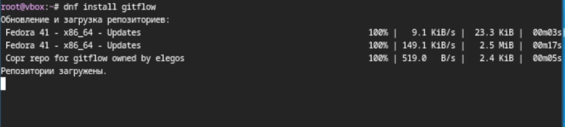{#fig:001 width=70%}

Устанавливаю Node.js  (рис. [-@fig:002]).

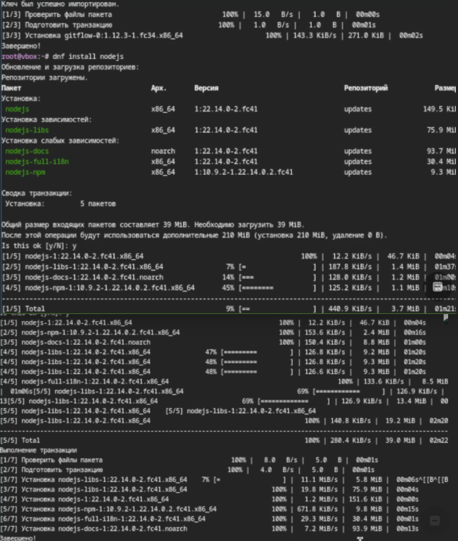{#fig:002 width=70%}

После установки начинаю настраивать программы. Настраиваю Node.js ввожу команду pnpm setup и добавляю каталог с исполняемыми файлами (рис. [-@fig:003]).

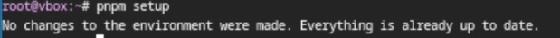{#fig:003 width=70%}

Перелогинусь.  (рис. [-@fig:004]).

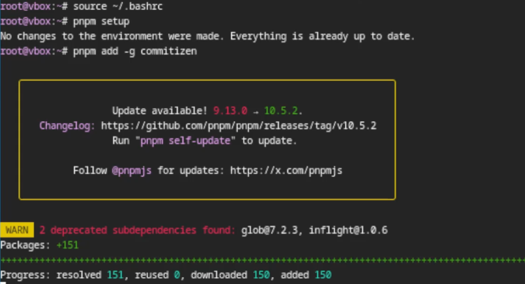{#fig:004 width=70%}

Испольщзую общепринятые коммиты  (рис. [-@fig:005]).

{#fig:005 width=70%}

## Практический сценарий использования git

Начинаю подключение репозитория к github. Создаю репозиторий на GitHub. Назыываю его git-extended  (рис. [-@fig:006]).

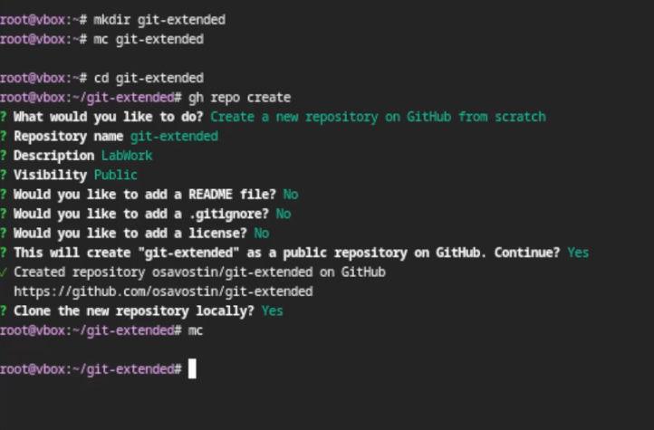{#fig:006 width=70%}

Делаю первый коммит  (рис. [-@fig:007]).

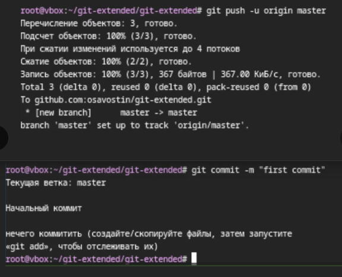{#fig:007 width=70%}

Конфигурирую пакеты Node.js и заполняю несколько параметров пакета. Добавляю в файл package.json команду для формирования коммитов/. Вид package.json (рис. [-@fig:008]).

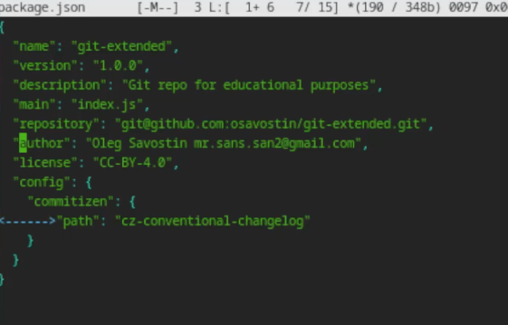{#fig:008 width=70%}

Добавляю новые файлы, выполняю коммит cz и отправляю на github (рис. [-@fig:009]).

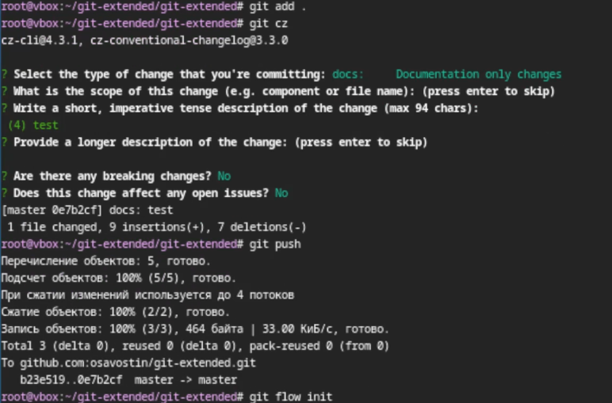{#fig:009 width=70%}

Теперь инициализирую git-flow, префикс для ярлыков установляю в v (рис. [-@fig:010]).

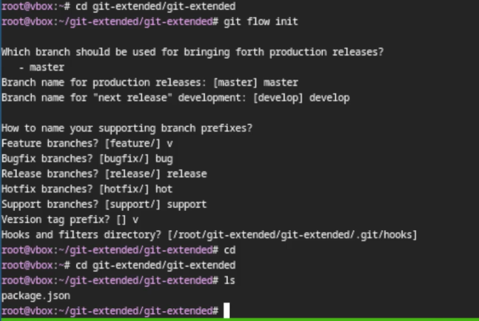{#fig:010 width=70%}

Проверяю, если я на ветке develop и загружаю весь репозиторий в хранилище. Устанавливаю внешнюю ветку как вышестоящую для этой ветки. Создаю релиз с версией 1.0.0 и создаю журнал изменений (рис. [-@fig:011]).

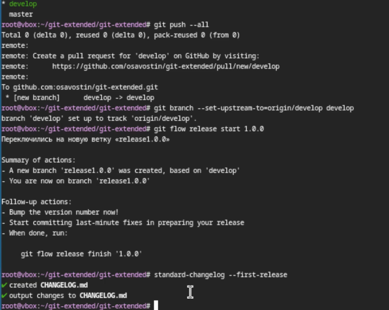{#fig:011 width=70%}

Добавляю журнал изменений в индекс и заливаю релизную ветку в основную ветку (рис. [-@fig:012]).

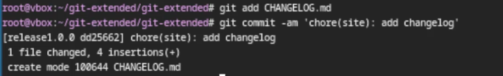{#fig:012 width=70%}

Отправляю все данные на гитхаб и создаю релиз на гитхаб (рис. [-@fig:013]).

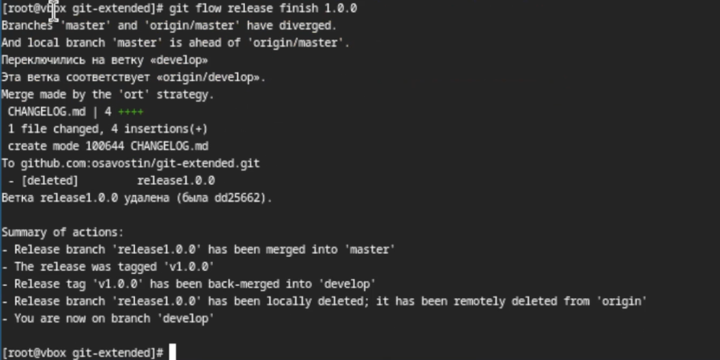{#fig:013 width=70%}

## Версия 1.2.3

Приступаем ко второму этапу
Разработка новой функциональности. Создаю ветку для новой функциональности. Объединяю ветку feature_branch с develop. Создаю релиз с версией 1.2.3 (рис. [-@fig:014]).

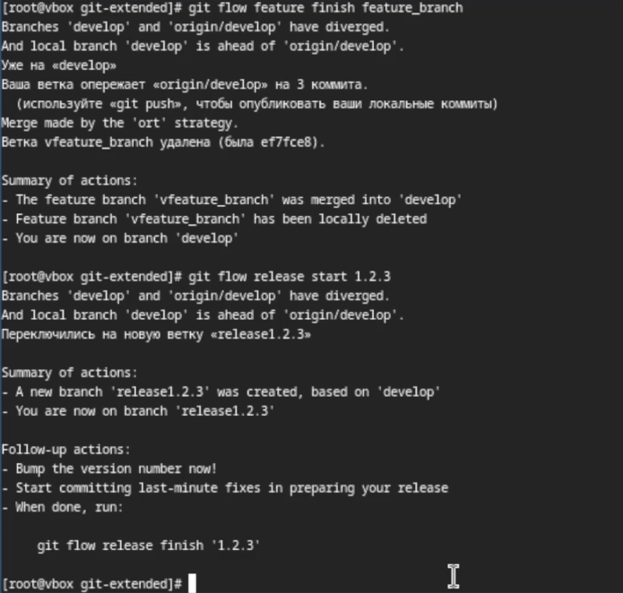{#fig:014 width=70%}

Обновляю номер версии в файле package.json и устанавливаю её в 1.2.3 (рис. [-@fig:015]).

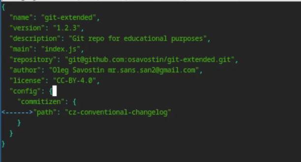{#fig:015 width=70%}

Создаю журнал изменений и добавляю его в индекс(рис. [-@fig:016]) (рис. [-@fig:017]) 

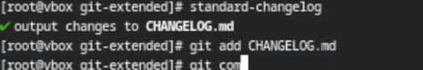{#fig:016 width=70%}

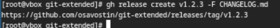{#fig:017 width=70%}

Заливаю ветку в основную ветку и отправляю данные на гитхаб, после чего создаю релиз на гитхаб с комментарием из журнала изменений  (рис. [-@fig:018]) (рис. [-@fig:019]) (рис. [-@fig:020]) .

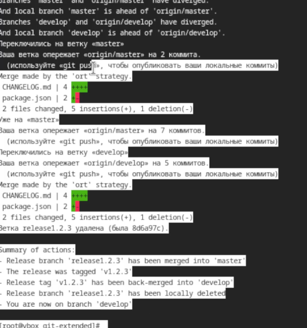{#fig:018 width=70%}

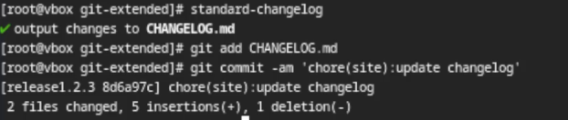{#fig:019 width=70%}

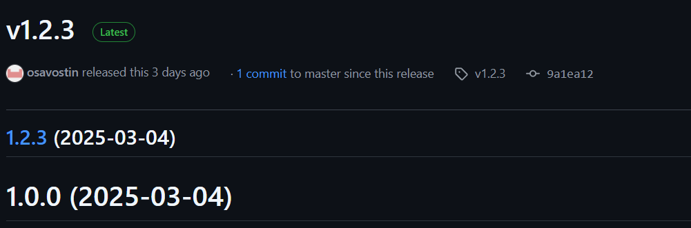{#fig:020 width=70%}

# Выводы

Я получил навыки правильной работы с репозиториями git.

# Список литературы{.unnumbered}

Лабораторная работа номер 4

:::

