---
## Front matter
title: "Лабораторная работа №4"
subtitle: "Дисциплина: Операционные системы"
author: "Савостин Олег"

## Generic otions
lang: ru-RU
toc-title: "Содержание"

## Bibliography
bibliography: bib/cite.bib
csl: pandoc/csl/gost-r-7-0-5-2008-numeric.csl

## Pdf output format
toc: true # Table of contents
toc-depth: 2
lof: true # List of figures
lot: true # List of tables
fontsize: 12pt
linestretch: 1.5
papersize: a4
documentclass: scrreprt
## I18n polyglossia
polyglossia-lang:
  name: russian
  options:
	- spelling=modern
	- babelshorthands=true
polyglossia-otherlangs:
  name: english
## I18n babel
babel-lang: russian
babel-otherlangs: english
## Fonts
mainfont: IBM Plex Serif
romanfont: IBM Plex Serif
sansfont: IBM Plex Sans
monofont: IBM Plex Mono
mathfont: STIX Two Math
mainfontoptions: Ligatures=Common,Ligatures=TeX,Scale=0.94
romanfontoptions: Ligatures=Common,Ligatures=TeX,Scale=0.94
sansfontoptions: Ligatures=Common,Ligatures=TeX,Scale=MatchLowercase,Scale=0.94
monofontoptions: Scale=MatchLowercase,Scale=0.94,FakeStretch=0.9
mathfontoptions:
## Biblatex
biblatex: true
biblio-style: "gost-numeric"
biblatexoptions:
  - parentracker=true
  - backend=biber
  - hyperref=auto
  - language=auto
  - autolang=other*
  - citestyle=gost-numeric
## Pandoc-crossref LaTeX customization
figureTitle: "Рис."
tableTitle: "Таблица"
listingTitle: "Листинг"
lofTitle: "Список иллюстраций"
lotTitle: "Список таблиц"
lolTitle: "Листинги"
## Misc options
indent: true
header-includes:
  - \usepackage{indentfirst}
  - \usepackage{float} # keep figures where there are in the text
  - \floatplacement{figure}{H} # keep figures where there are in the text
---

# Цель работы

Получить навыки правильной работы с репозиториями git.

# Задание

1. Установка программного обеспечения
2. Практический сценарий использования git

# Теоретическое введение

    Основные ветки (master) и ветки разработки (develop)
        Для фиксации истории проекта в рамках этого процесса вместо одной ветки master используются две ветки. В ветке master хранится официальная история релиза, а ветка develop предназначена для объединения всех функций. Кроме того, для удобства рекомендуется присваивать всем коммитам в ветке master номер версии.

        При использовании библиотеки расширений git-flow нужно инициализировать структуру в существующем репозитории:

        git flow init

        Для github параметр Version tag prefix следует установить в v.

        После этого проверьте, на какой ветке Вы находитесь:

        git branch

    Функциональные ветки (feature)
        Под каждую новую функцию должна быть отведена собственная ветка, которую можно отправлять в центральный репозиторий для создания резервной копии или совместной работы команды. Ветки feature создаются не на основе master, а на основе develop. Когда работа над функцией завершается, соответствующая ветка сливается обратно с веткой develop. Функции не следует отправлять напрямую в ветку master.
        Как правило, ветки feature создаются на основе последней ветки develop.

        Создание функциональной ветки

            Создадим новую функциональную ветку:

            git flow feature start feature_branch

            Далее работаем как обычно.

        Окончание работы с функциональной веткой

            По завершении работы над функцией следует объединить ветку feature_branch с develop:

            git flow feature finish feature_branch

    Ветки выпуска (release)
        Когда в ветке develop оказывается достаточно функций для выпуска, из ветки develop создаётся ветка release. Создание этой ветки запускает следующий цикл выпуска, и с этого момента новые функции добавить больше нельзя — допускается лишь отладка, создание документации и решение других задач. Когда подготовка релиза завершается, ветка release сливается с master и ей присваивается номер версии. После нужно выполнить слияние с веткой develop, в которой с момента создания ветки релиза могли возникнуть изменения.
        Благодаря тому, что для подготовки выпусков используется специальная ветка, одна команда может дорабатывать текущий выпуск, в то время как другая команда продолжает работу над функциями для следующего.

        Создать новую ветку release можно с помощью следующей команды:

        git flow release start 1.0.0

        Для завершения работы на ветке release используются следующие команды:

        git flow release finish 1.0.0

    Ветки исправления (hotfix)
        Ветки поддержки или ветки hotfix используются для быстрого внесения исправлений в рабочие релизы. Они создаются от ветки master. Это единственная ветка, которая должна быть создана непосредственно от master. Как только исправление завершено, ветку следует объединить с master и develop. Ветка master должна быть помечена обновлённым номером версии.
        Наличие специальной ветки для исправления ошибок позволяет команде решать проблемы, не прерывая остальную часть рабочего процесса и не ожидая следующего цикла релиза.

        Ветку hotfix можно создать с помощью следующих команд:

        git flow hotfix start hotfix_branch

        По завершении работы ветка hotfix объединяется с master и develop:

        git flow hotfix finish hotfix_branch

# Выполнение лабораторной работы

## Установка программного обеспечения

Сперва устанавливаю git-flow из коллекции репозиториев Copr (рис. [-@fig:001]).

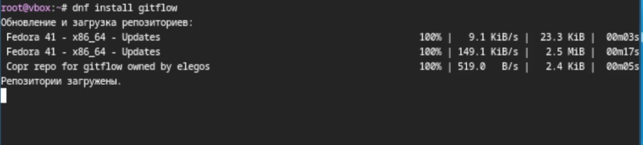{#fig:001 width=70%}

Устанавливаю Node.js  (рис. [-@fig:002]).

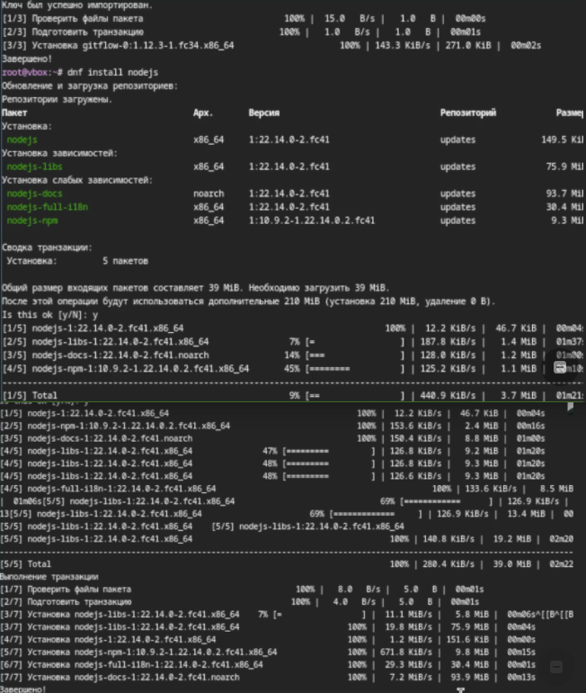{#fig:002 width=70%}

После установки начинаю настраивать программы. Настраиваю Node.js ввожу команду pnpm setup и добавляю каталог с исполняемыми файлами (рис. [-@fig:003]).

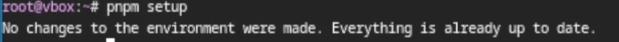{#fig:003 width=70%}

Перелогинусь.  (рис. [-@fig:004]).

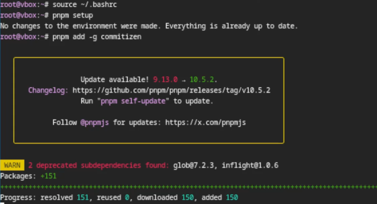{#fig:004 width=70%}

Испольщзую общепринятые коммиты  (рис. [-@fig:005]).

{#fig:005 width=70%}

## Практический сценарий использования git

Начинаю подключение репозитория к github. Создаю репозиторий на GitHub. Назыываю его git-extended  (рис. [-@fig:006]).

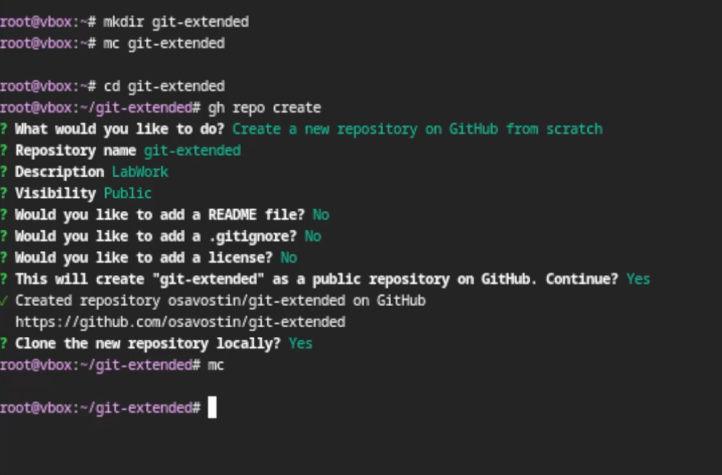{#fig:006 width=70%}

Делаю первый коммит  (рис. [-@fig:007]).

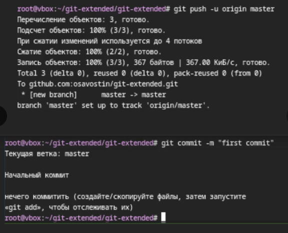{#fig:007 width=70%}

Конфигурирую пакеты Node.js и заполняю несколько параметров пакета. Добавляю в файл package.json команду для формирования коммитов/. Вид package.json (рис. [-@fig:008]).

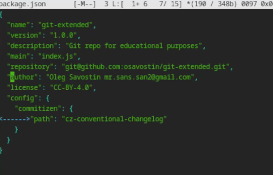{#fig:008 width=70%}

Добавляю новые файлы, выполняю коммит cz и отправляю на github (рис. [-@fig:009]).

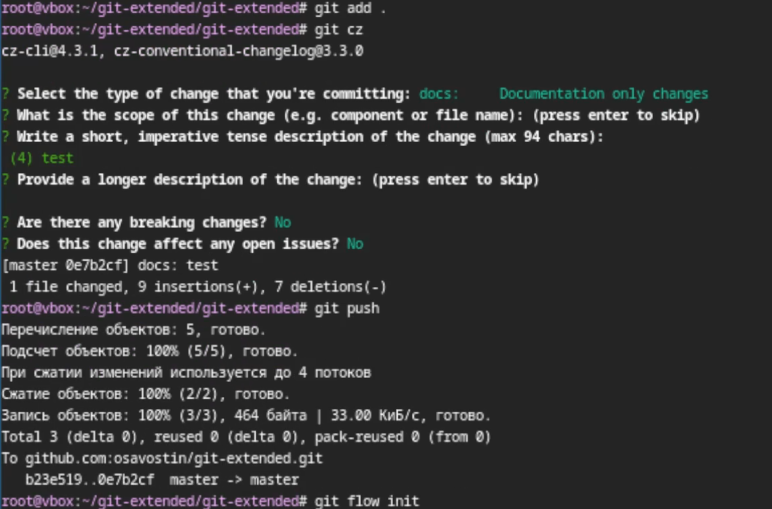{#fig:009 width=70%}

Теперь инициализирую git-flow, префикс для ярлыков установляю в v (рис. [-@fig:010]).

{#fig:010 width=70%}

Проверяю, если я на ветке develop и загружаю весь репозиторий в хранилище. Устанавливаю внешнюю ветку как вышестоящую для этой ветки. Создаю релиз с версией 1.0.0 и создаю журнал изменений (рис. [-@fig:011]).

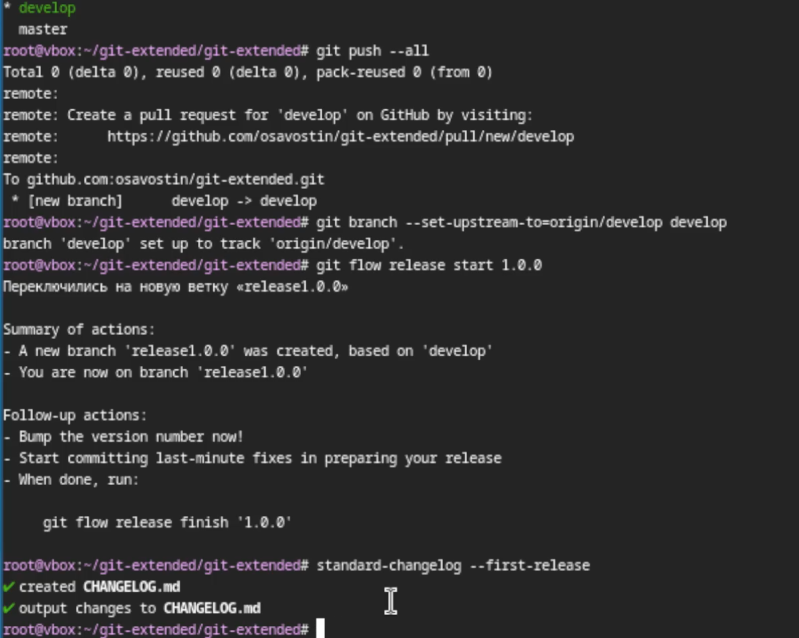{#fig:011 width=70%}

Добавляю журнал изменений в индекс и заливаю релизную ветку в основную ветку (рис. [-@fig:012]).

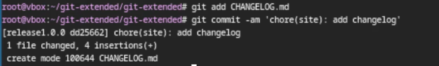{#fig:012 width=70%}

Отправляю все данные на гитхаб и создаю релиз на гитхаб (рис. [-@fig:013]).

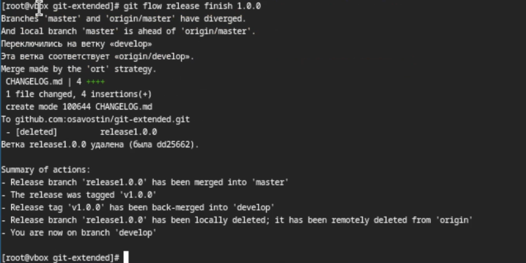{#fig:013 width=70%}

Приступаем ко второму этапу
Разработка новой функциональности. Создаю ветку для новой функциональности. Объединяю ветку feature_branch с develop. Создаю релиз с версией 1.2.3 (рис. [-@fig:014]).

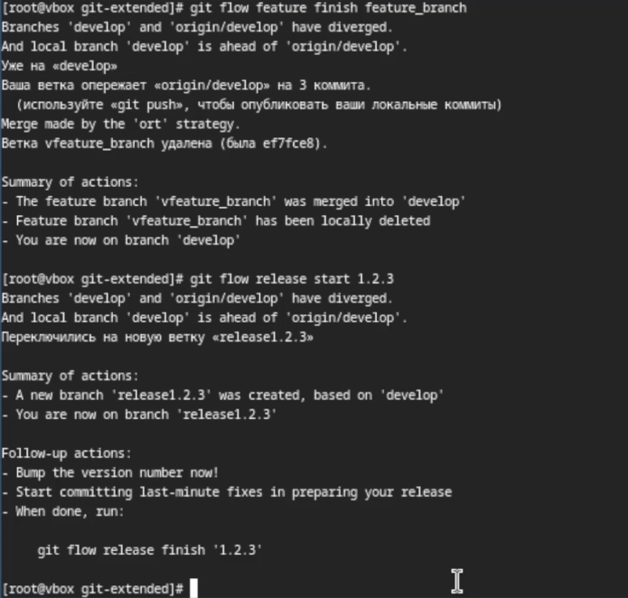{#fig:014 width=70%}

Обновляю номер версии в файле package.json и устанавливаю её в 1.2.3 (рис. [-@fig:015]).

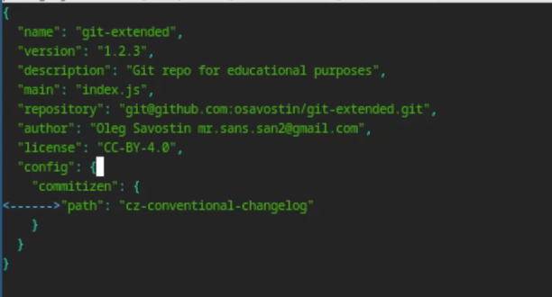{#fig:015 width=70%}

Создаю журнал изменений и добавляю его в индекс(рис. [-@fig:016]) (рис. [-@fig:017]) 

{#fig:016 width=70%}

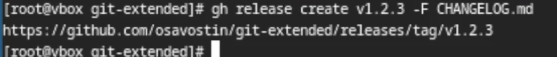{#fig:017 width=70%}

Заливаю ветку в основную ветку и отправляю данные на гитхаб, после чего создаю релиз на гитхаб с комментарием из журнала изменений  (рис. [-@fig:018]) (рис. [-@fig:019]) (рис. [-@fig:020]) .

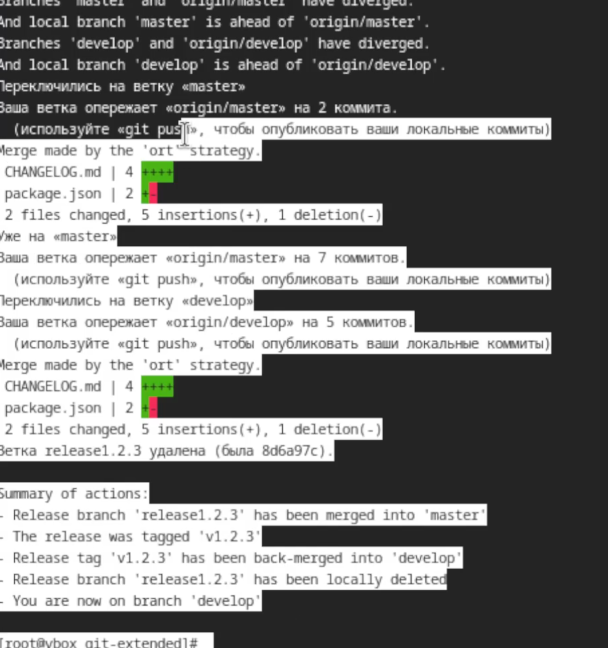{#fig:018 width=70%}

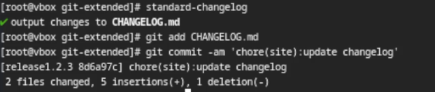{#fig:019 width=70%}

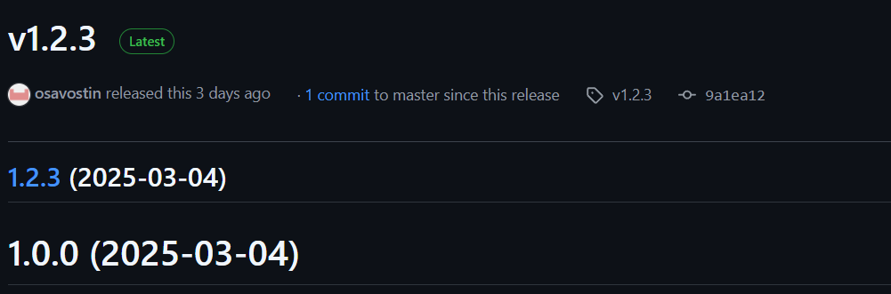{#fig:020 width=70%}

# Выводы

Я получил навыки правильной работы с репозиториями git.

# Список литературы{.unnumbered}

Лабораторная работа номер 4

::: {#refs}
:::
