---
## Front matter
title: "Лабораторная работа №5"
subtitle: "Дисциплина: Операционные системы"
author: "Савостин Олег"

## Generic otions
lang: ru-RU
toc-title: "Содержание"

## Bibliography
bibliography: bib/cite.bib
csl: pandoc/csl/gost-r-7-0-5-2008-numeric.csl

## Pdf output format
toc: true # Table of contents
toc-depth: 2
lof: true # List of figures
lot: true # List of tables
fontsize: 12pt
linestretch: 1.5
papersize: a4
documentclass: scrreprt
## I18n polyglossia
polyglossia-lang:
  name: russian
  options:
	- spelling=modern
	- babelshorthands=true
polyglossia-otherlangs:
  name: english
## I18n babel
babel-lang: russian
babel-otherlangs: english
## Fonts
mainfont: IBM Plex Serif
romanfont: IBM Plex Serif
sansfont: IBM Plex Sans
monofont: IBM Plex Mono
mathfont: STIX Two Math
mainfontoptions: Ligatures=Common,Ligatures=TeX,Scale=0.94
romanfontoptions: Ligatures=Common,Ligatures=TeX,Scale=0.94
sansfontoptions: Ligatures=Common,Ligatures=TeX,Scale=MatchLowercase,Scale=0.94
monofontoptions: Scale=MatchLowercase,Scale=0.94,FakeStretch=0.9
mathfontoptions:
## Biblatex
biblatex: true
biblio-style: "gost-numeric"
biblatexoptions:
  - parentracker=true
  - backend=biber
  - hyperref=auto
  - language=auto
  - autolang=other*
  - citestyle=gost-numeric
## Pandoc-crossref LaTeX customization
figureTitle: "Рис."
tableTitle: "Таблица"
listingTitle: "Листинг"
lofTitle: "Список иллюстраций"
lotTitle: "Список таблиц"
lolTitle: "Листинги"
## Misc options
indent: true
header-includes:
  - \usepackage{indentfirst}
  - \usepackage{float} # keep figures where there are in the text
  - \floatplacement{figure}{H} # keep figures where there are in the text
---

# Цель работы

Целью данной работы является настройка рабочей среды

# Задание

1. Менеджер паролей pass
2. Управление файлами конфигурации
3. Дополнительное программное обеспечение.

# Теоретическое введение

    Менеджер паролей pass — программа, сделанная в рамках идеологии Unix.
    Также носит название стандартного менеджера паролей для Unix (The standard Unix password manager).

Основные свойства

    Данные хранятся в файловой системе в виде каталогов и файлов.
    Файлы шифруются с помощью GPG-ключа.

Структура базы паролей

    Структура базы может быть произвольной, если Вы собираетесь использовать её напрямую, без промежуточного программного обеспечения. Тогда семантику структуры базы данных Вы держите в своей голове.
    Если же необходимо использовать дополнительное программное обеспечение, необходимо семантику заложить в структуру базы паролей.

Семантическая структура базы паролей

    Рассмотрим пользователя user в домене example.com, порт 22.

    Отсутствие имени пользователя или порта в имени файла означает, что любое имя пользователя и порт будут совпадать:

    example.com.pgp

    Соответствующее имя пользователя может быть именем файла внутри каталога, имя которого совпадает с хостом. Это полезно, если в базе есть пароли для нескольких пользователей на одном хосте:

    example.com/user.pgp

    Имя пользователя также может быть записано в виде префикса, отделенного от хоста знаком @:

    user@example.com.pgp

    Соответствующий порт может быть указан после хоста, отделённый двоеточием (:):

    example.com:22.pgp
    example.com:22/user.pgp
    user@example.com:22.pgp

    Эти все записи могут быть расположены в произвольных каталогах, задающих Вашу собственную иерархию.

Реализации

Утилиты командной строки

    На данный момент существует 2 основных реализации:
        pass — классическая реализация в виде shell-скриптов (https://www.passwordstore.org/);
        gopass — реализация на go с дополнительными интегрированными функциями (https://www.gopass.pw/).
    Дальше в тексте будет использоваться программа pass, но всё то же самое можно сделать с помощью программы gopass.

# Выполнение лабораторной работы

## Менеджер паролей pass

В первую очередь устанавливаю pass gopass(рис. [-@fig:001]) (рис. [-@fig:002]).

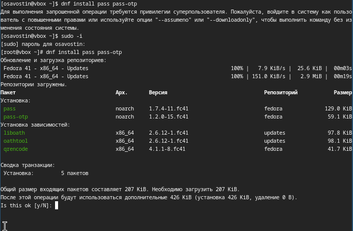{#fig:001 width=70%}

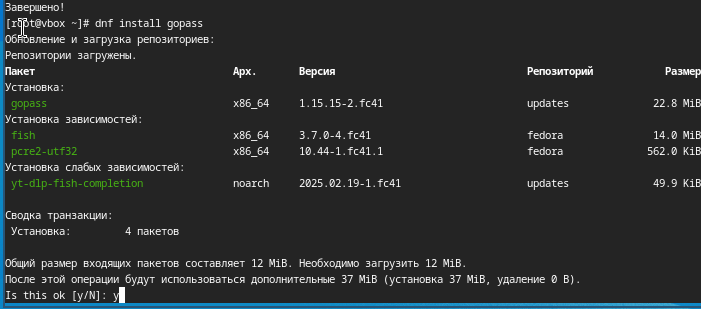{#fig:002 width=70%}

Просматриваю ключи GPG и инициализирую хранилище (рис. [-@fig:003]).

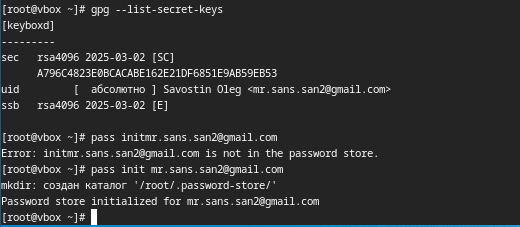{#fig:003 width=70%}

Создаю структуру git (рис. [-@fig:004]) (рис. [-@fig:005]) (рис. [-@fig:006]).

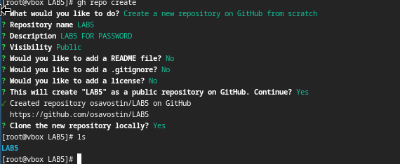{#fig:004 width=70%}

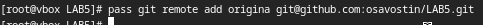{#fig:005 width=70%}

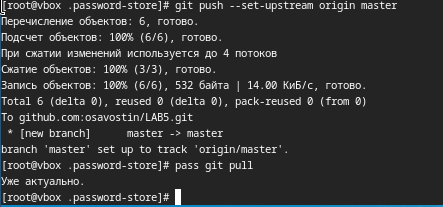{#fig:006 width=70%}

Устанавливаю плагин на Firefox (рис. [-@fig:007]).

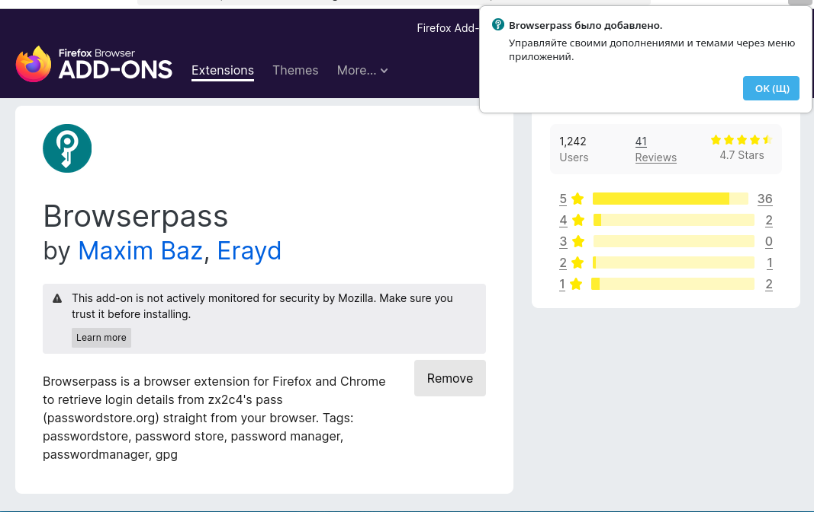{#fig:007 width=70%}

Устанавливаю browserpass (рис. [-@fig:008]).

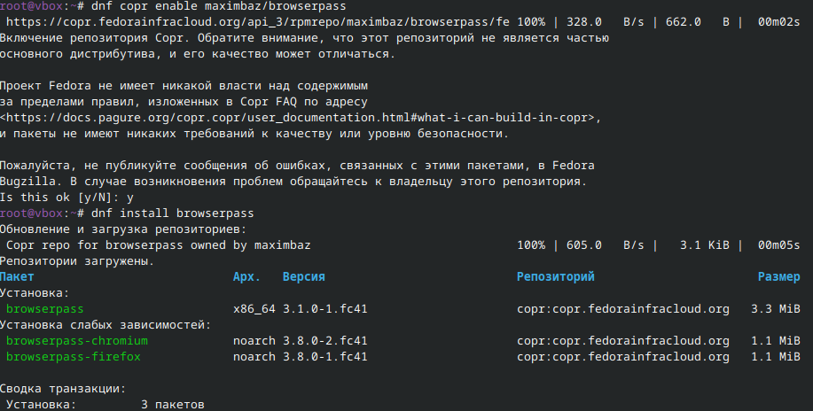{#fig:008 width=70%}

Выполняю команду (рис. [-@fig:009]).

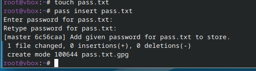{#fig:009 width=70%}

Заменяю существующий пароль (рис. [-@fig:010]).

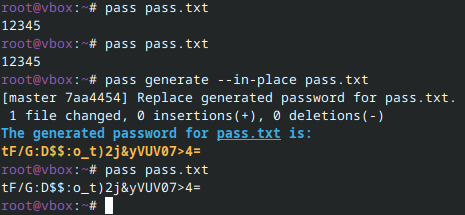{#fig:010 width=70%}

## Управление файлами конфигурации
### Дополнительное программное обеспечение.

Устанавливаю программное обеспечение(рис. [-@fig:011]).

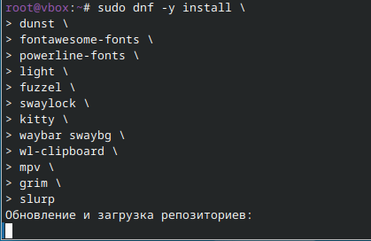{#fig:011 width=70%}

Устанавливаю шрифты (рис. [-@fig:012]).

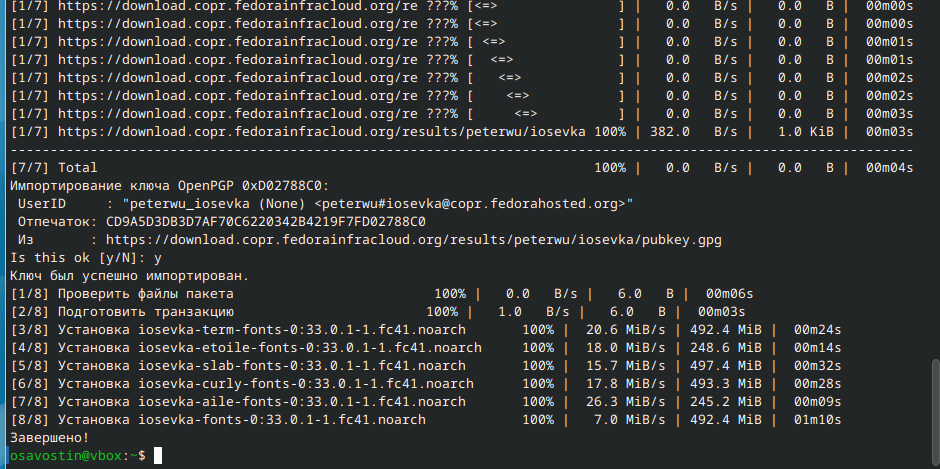{#fig:012 width=70%}

Устанавливаю бинарный файл. Создаю репозиторий для конфигурационных файлов на основе шаблона (рис. [-@fig:013]).

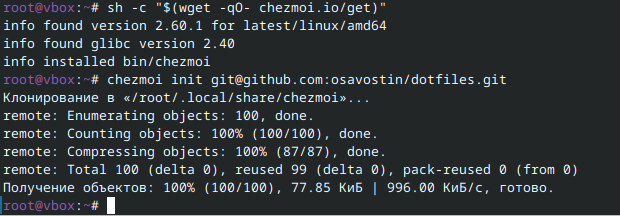{#fig:013 width=70%}

Инициализирую chezmoi c dotfiles. Проверяю какие изменения внесет chezmoi и запускаю chezmoi apply -v (рис. [-@fig:014]).

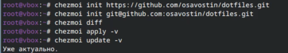{#fig:014 width=70%}

Открываю файл и делаю замены (рис. [-@fig:015]).

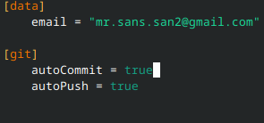{#fig:015 width=70%}

Также осваиваю материал о том, как это делать на других машинах.

# Выводы

В ходе данной работы была настроена рабочая среда

# Список литературы{.unnumbered}

Лабораторная работа №5 ТУИС
::: {#refs}
:::
