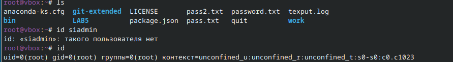

---
## Front matter
lang: ru-RU
title: "Лабораторная работа №6"
subtitle: "Дисциплина: Операционные системы"
author: 
  - Савостин Олег
institute:
  - Российский университет дружбы народов, Москва, Россия

## i18n babel
babel-lang: russian
babel-otherlangs: english

## Formatting pdf
toc: false
toc-title: Содержание
slide_level: 2
aspectratio: 169
section-titles: true
theme: metropolis
header-includes:
 - \metroset{progressbar=frametitle,sectionpage=progressbar,numbering=fraction}
---

# Информация

## Докладчик

:::::::::::::: {.columns align=center}
::: {.column width="70%"}

  * Савостин Олег
  * студент Физики-математического факультета, Математика и Механика.
  * Российский университет дружбы народов
  * [1032245472@pfur..ru](mailto:1032245472@pfur.ru)

:::
::::::::::::::

# Вводная часть

# Цель работы

Приобретение практических навыков взаимодействия пользователя с системой по-
средством командной строки

# Задание

1. Базовые команды в терминале.

# Теоретическое введение

В операционной системе типа Linux взаимодействие пользователя с системой обычно
осуществляется с помощью командной строки посредством построчного ввода ко-
манд. При этом обычно используется командные интерпретаторы языка shell: /bin/sh;
/bin/csh; /bin/ksh.
Формат команды. Командой в операционной системе называется записанный по
специальным правилам текст (возможно с аргументами), представляющий собой ука-
зание на выполнение какой-либо функций (или действий) в операционной системе.
Обычно первым словом идёт имя команды, остальной текст — аргументы или опции,
конкретизирующие действие.
Общий формат команд можно представить следующим образом:
<имя_команды><разделитель><аргументы>
Команда man. Команда man используется для просмотра (оперативная помощь) в диа-
логовом режиме руководства (manual) по основным командам операционной системы
типа Linux.
Формат команды:
man <команда>
Пример (вывод информации о команде man):
1 man man
Для управления просмотром результата выполнения команды man можно использовать
следующие клавиши:
– Space — перемещение по документу на одну страницу вперёд;
– Enter — перемещение по документу на одну строку вперёд;
– q — выход из режима просмотра описания.
Команда cd. Команда cd используется для перемещения по файловой системе опера-
ционной системы типа Linux.
Замечание 1. Файловая система ОС типа Linux — иерархическая система каталогов,
подкаталогов и файлов, которые обычно организованы и сгруппированы по функ-
циональному признаку. Самый верхний каталог в иерархии называется корневым
и обозначается символом /. Корневой каталог содержит системные файлы и другие
каталоги

# Выполнение лабораторной работы

Проверяю полное название домашнего каталога(рис. [-@fig:001]).

{#fig:001 width=70%}

Перехожу в каталог tmp и смотрю файлы в нем. (рис. [-@fig:002]).

{#fig:002 width=70%}

Определяю если есть подкаталог cron (рис. [-@fig:003]).

{#fig:003 width=70%}

Перехожу в домашний каталог и вывожу на экран его содержимую Владелец - root, супер-пользователь (рис. [-@fig:004]).

{#fig:004 width=70%}

Создаю в домашнем каталоге новый каталог newdir и morefun(рис. [-@fig:005]).

{#fig:005 width=70%}

Создаю одной командой три каталога и одной командой их удаляю (рис. [-@fig:006]).

{#fig:006 width=70%}

Пробую удалить newdir, но команда неверная, ибо это каталог, а не конкретный файл(рис. [-@fig:007]).

{#fig:007 width=70%}

Удаляю ненужный каталог (рис. [-@fig:008]).

{#fig:008 width=70%}

Определяю какую опцию нужно использовать чтобы просмотреть содержимое(рис. [-@fig:009]).

{#fig:009 width=70%}

Смотрю, какая опция  подойдет, чтобы отсортировать по времени изменения выводимый список каталога (рис. [-@fig:010]).

{#fig:010 width=70%}

Использую команду man для просмотра описания команд (рис. [-@fig:011]) (рис. [-@fig:012]) (рис. [-@fig:013]) (рис. [-@fig:014]) (рис. [-@fig:015]).

{#fig:011 width=70%}

{#fig:012 width=70%}

{#fig:013 width=70%}

{#fig:014 width=70%}

{#fig:015 width=70%}

Использую команду history и исполню модификацию (рис. [-@fig:016]) (рис. [-@fig:017]).

{#fig:016 width=70%}

{#fig:017 width=70%}

# Выводы

В ходе работы, я приобрел практических навыков взаимодействия пользователя с системой по-
средством командной строки

# Список литературы{.unnumbered}

Лабораторная работа 6, ТУИС
::: {#refs}
:::
