---
## Front matter
lang: ru-RU
title: "Лабораторная работа №3"
subtitle: "Дисциплина: Операционные системы"
author: 
  - Савостин Олег
institute:
  - Российский университет дружбы народов, Москва, Россия

## i18n babel
babel-lang: russian
babel-otherlangs: english

## Formatting pdf
toc: false
toc-title: Содержание
slide_level: 2
aspectratio: 169
section-titles: true
theme: metropolis
header-includes:
 - \metroset{progressbar=frametitle,sectionpage=progressbar,numbering=fraction}
---

# Информация

## Докладчик

:::::::::::::: {.columns align=center}
::: {.column width="70%"}

  * Савостин Олег
  * студент Физики-математического факультета, Математика и Механика.
  * Российский университет дружбы народов
  * [1032245472@pfur..ru](mailto:1032245472@pfur.ru)

:::
::::::::::::::

# Цель работы

Целью работы является ознакомление с файловой системой Linux, её структурой, именами и содержанием каталогов. Приобретение практических навыков по применению команд для работы
с файлами и каталогами, по управлению процессами (и работами), по проверке использования диска и обслуживанию файловой системы.

# Задание

1. Использование команд.

# Теоретическое введение

Для создания текстового файла можно использовать команду touch.
Формат команды:
1 touch имя-файла
Для просмотра файлов небольшого размера можно использовать команду cat.
Формат команды:
1 cat имя-файла
Для просмотра файлов постранично удобнее использовать команду less.
Формат команды:
1 less имя-файла
Следующие клавиши используются для управления процессом просмотра:
– Space — переход к следующей странице,
– ENTER — сдвиг вперёд на одну строку,
– b — возврат на предыдущую страницу,
– h — обращение за подсказкой,
– q — выход из режима просмотра файла.

# Теоретическое введение

Команда head выводит по умолчанию первые 10 строк файла.
Формат команды:
1 head [-n] имя-файла,
где n — количество выводимых строк.
Команда tail выводит умолчанию 10 последних строк файла.
Формат команды:
1 tail [-n] имя-файла,
где n — количество выводимых строк.
Кулябов Д. С. и др. Операционные системы 47
5.2.2. Копирование файлов и каталогов

# Теоретическое введение

Команда cp используется для копирования файлов и каталогов.
Формат команды:
1 cp [-опции] исходный_файл целевой_файл
Примеры:
1. Копирование файла в текущем каталоге. Скопировать файл ~/abc1 в файл april
и в файл may:
1 cd
2 touch abc1
3 cp abc1 april
4 cp abc1 may
2. Копирование нескольких файлов в каталог. Скопировать файлы april и may в каталог
monthly:
1 mkdir monthly
2 cp april may monthly
3. Копирование файлов в произвольном каталоге. Скопировать файл monthly/may в файл
с именем june:
1 cp monthly/may monthly/june
2 ls monthly

# Теоретическое введение

Опция i в команде cp выведет на экран запрос подтверждения о перезаписи файла.
Для рекурсивного копирования каталогов, содержащих файлы, используется команда
cp с опцией r.
Примеры:
1. Копирование каталогов в текущем каталоге. Скопировать каталог monthly в каталог
monthly.00:
1 mkdir monthly.00
2 cp -r monthly monthly.00
2. Копирование каталогов в произвольном каталоге. Скопировать каталог monthly.00
в каталог /tmp
1 cp -r monthly.00 /tmp

# Выполнение лабораторной работы

Выполняю все примеры в лабораторной работе.

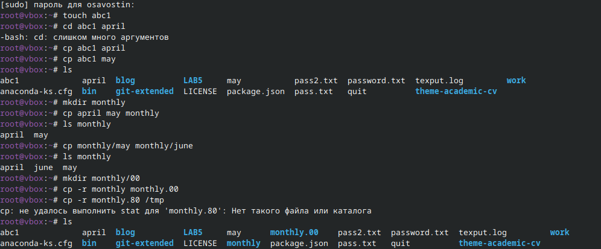{#fig:001 width=70%}

# Выполнение лабораторной работы

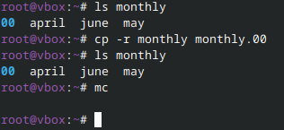{#fig:002 width=70%}

# Выполнение лабораторной работы

{#fig:003 width=70%}

# Выполнение лабораторной работы

{#fig:004 width=70%}

# Выполнение лабораторной работы

{#fig:005 width=70%}

# Выполнение лабораторной работы

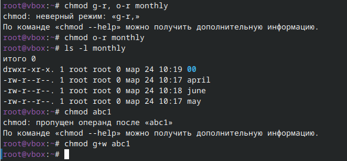{#fig:006 width=70%}

# Выполнение лабораторной работы

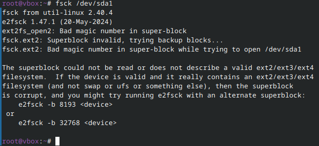{#fig:007 width=70%}

Выполняю вторую часть работы.(рис. [-@fig:008]) 

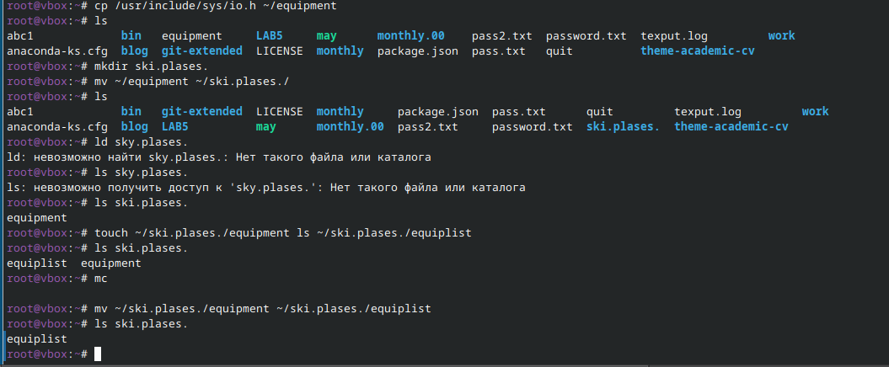{#fig:008 width=70%}

# Выполнение лабораторной работы

Следую указаниям в лабораторной работе (рис. [-@fig:009]) 

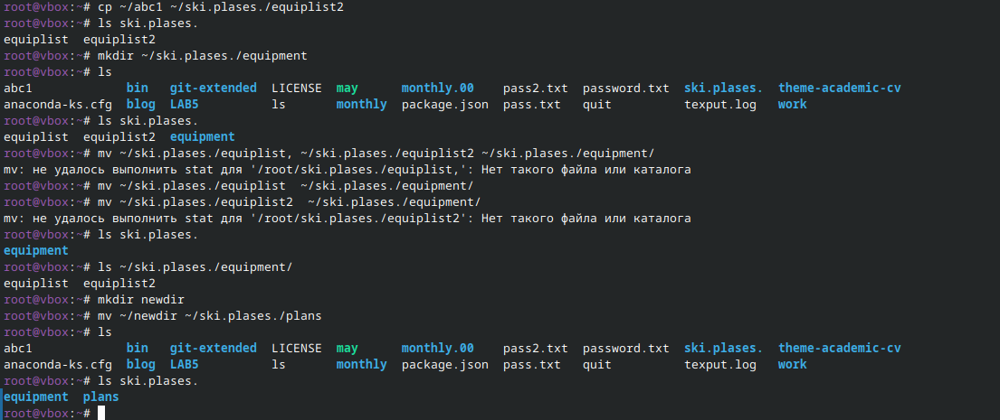{#fig:009 width=70%}

# Выполнение лабораторной работы

Выполняю команды на выдачу конкретных прав для файлов (рис. [-@fig:010]) 

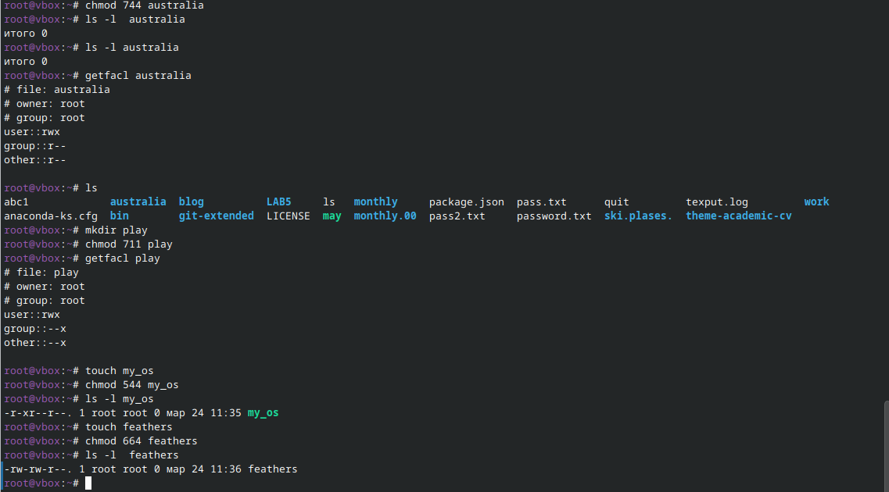{#fig:010 width=70%}

# Выполнение лабораторной работы

Проверяю содержимое файла passwd(рис. [-@fig:011]) 

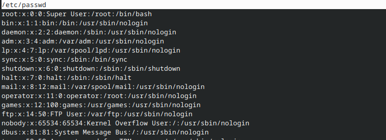{#fig:011 width=70%}

# Выполнение лабораторной работы

Завершаю выполнение задач (рис. [-@fig:012]) 

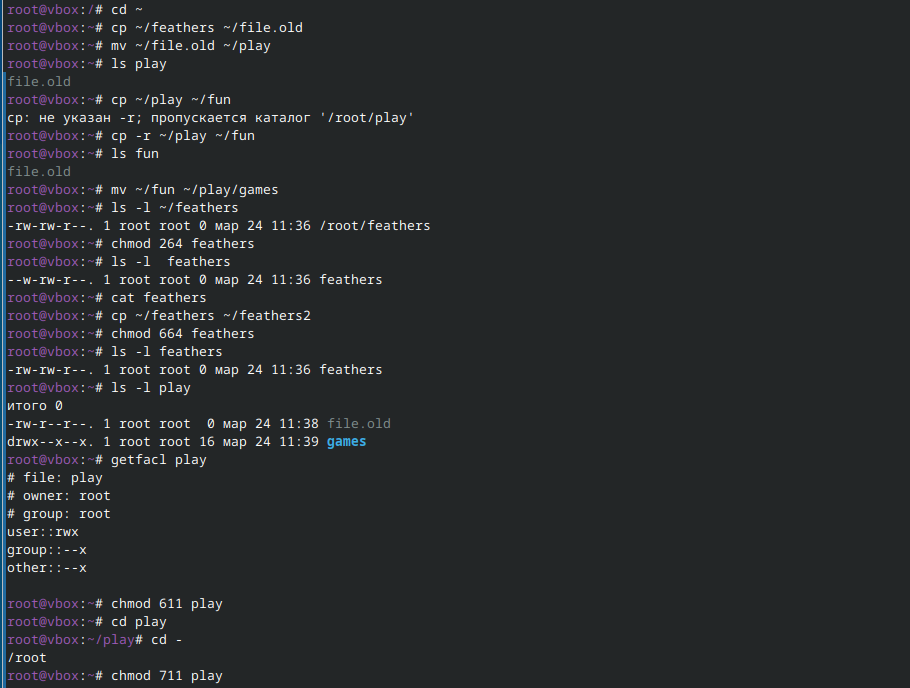{#fig:012 width=70%}

# Выполнение лабораторной работы

Теперь проверяю что делают команды fsck mount mkfs kill (рис. [-@fig:013]) (рис. [-@fig:014]) (рис. [-@fig:015]) (рис. [-@fig:016]) 

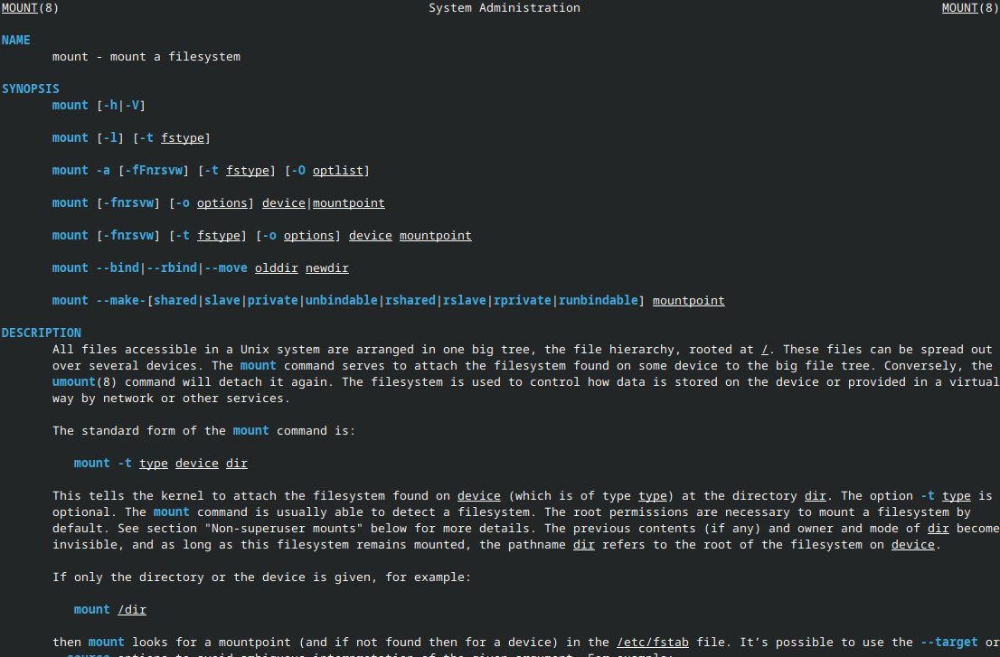{#fig:013 width=70%}

# Выполнение лабораторной работы

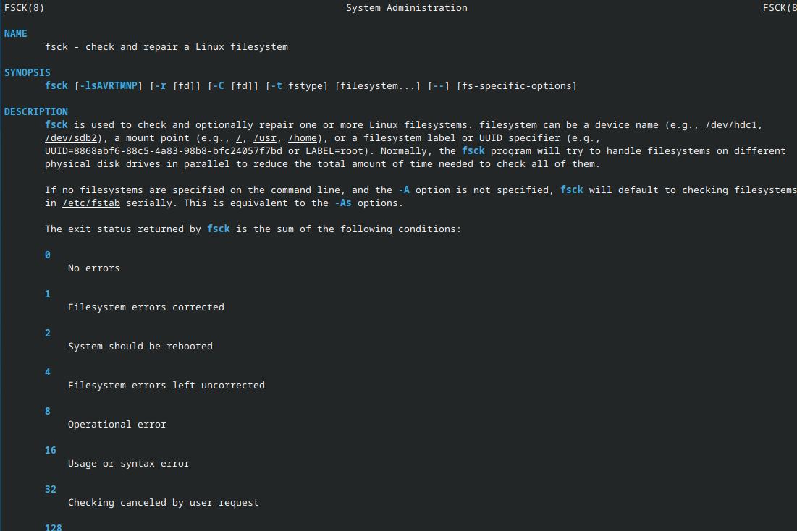{#fig:014 width=70%}

# Выполнение лабораторной работы

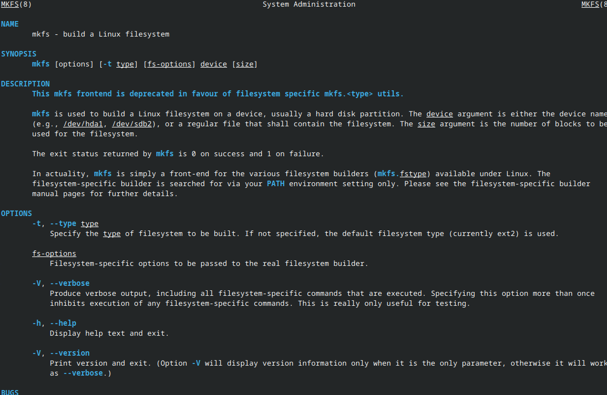{#fig:015 width=70%}

# Выполнение лабораторной работы

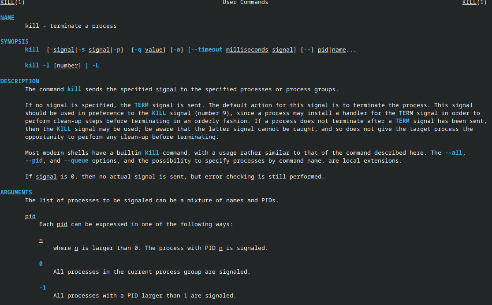{#fig:016 width=70%}

# Выводы

В ходе данной лабораторной работы я освоил навыки пользования файловой системой Linux, её структурой, именами и содержанием каталогов

# Список литературы{.unnumbered}

Лабораторная работа 7
::: {#refs}
:::
