---
## Front matter
title: "Лабораторная работа №7"
subtitle: "Дисциплина: Операционные системы"
author: "Савостин Олег"

## Generic otions
lang: ru-RU
toc-title: "Содержание"

## Bibliography
bibliography: bib/cite.bib
csl: pandoc/csl/gost-r-7-0-5-2008-numeric.csl

## Pdf output format
toc: true # Table of contents
toc-depth: 2
lof: true # List of figures
lot: true # List of tables
fontsize: 12pt
linestretch: 1.5
papersize: a4
documentclass: scrreprt
## I18n polyglossia
polyglossia-lang:
  name: russian
  options:
	- spelling=modern
	- babelshorthands=true
polyglossia-otherlangs:
  name: english
## I18n babel
babel-lang: russian
babel-otherlangs: english
## Fonts
mainfont: IBM Plex Serif
romanfont: IBM Plex Serif
sansfont: IBM Plex Sans
monofont: IBM Plex Mono
mathfont: STIX Two Math
mainfontoptions: Ligatures=Common,Ligatures=TeX,Scale=0.94
romanfontoptions: Ligatures=Common,Ligatures=TeX,Scale=0.94
sansfontoptions: Ligatures=Common,Ligatures=TeX,Scale=MatchLowercase,Scale=0.94
monofontoptions: Scale=MatchLowercase,Scale=0.94,FakeStretch=0.9
mathfontoptions:
## Biblatex
biblatex: true
biblio-style: "gost-numeric"
biblatexoptions:
  - parentracker=true
  - backend=biber
  - hyperref=auto
  - language=auto
  - autolang=other*
  - citestyle=gost-numeric
## Pandoc-crossref LaTeX customization
figureTitle: "Рис."
tableTitle: "Таблица"
listingTitle: "Листинг"
lofTitle: "Список иллюстраций"
lotTitle: "Список таблиц"
lolTitle: "Листинги"
## Misc options
indent: true
header-includes:
  - \usepackage{indentfirst}
  - \usepackage{float} # keep figures where there are in the text
  - \floatplacement{figure}{H} # keep figures where there are in the text
---

# Цель работы

Целью работы является ознакомление с файловой системой Linux, её структурой, именами и содержанием каталогов. Приобретение практических навыков по применению команд для работы
с файлами и каталогами, по управлению процессами (и работами), по проверке использования диска и обслуживанию файловой системы.

# Задание

1. Использование команд.

# Теоретическое введение

Для создания текстового файла можно использовать команду touch.
Формат команды:
1 touch имя-файла
Для просмотра файлов небольшого размера можно использовать команду cat.
Формат команды:
1 cat имя-файла
Для просмотра файлов постранично удобнее использовать команду less.
Формат команды:
1 less имя-файла
Следующие клавиши используются для управления процессом просмотра:
– Space — переход к следующей странице,
– ENTER — сдвиг вперёд на одну строку,
– b — возврат на предыдущую страницу,
– h — обращение за подсказкой,
– q — выход из режима просмотра файла.
Команда head выводит по умолчанию первые 10 строк файла.
Формат команды:
1 head [-n] имя-файла,
где n — количество выводимых строк.
Команда tail выводит умолчанию 10 последних строк файла.
Формат команды:
1 tail [-n] имя-файла,
где n — количество выводимых строк.
Кулябов Д. С. и др. Операционные системы 47
5.2.2. Копирование файлов и каталогов
Команда cp используется для копирования файлов и каталогов.
Формат команды:
1 cp [-опции] исходный_файл целевой_файл
Примеры:
1. Копирование файла в текущем каталоге. Скопировать файл ~/abc1 в файл april
и в файл may:
1 cd
2 touch abc1
3 cp abc1 april
4 cp abc1 may
2. Копирование нескольких файлов в каталог. Скопировать файлы april и may в каталог
monthly:
1 mkdir monthly
2 cp april may monthly
3. Копирование файлов в произвольном каталоге. Скопировать файл monthly/may в файл
с именем june:
1 cp monthly/may monthly/june
2 ls monthly
Опция i в команде cp выведет на экран запрос подтверждения о перезаписи файла.
Для рекурсивного копирования каталогов, содержащих файлы, используется команда
cp с опцией r.
Примеры:
1. Копирование каталогов в текущем каталоге. Скопировать каталог monthly в каталог
monthly.00:
1 mkdir monthly.00
2 cp -r monthly monthly.00
2. Копирование каталогов в произвольном каталоге. Скопировать каталог monthly.00
в каталог /tmp
1 cp -r monthly.00 /tmp

# Выполнение лабораторной работы

Выполняю все примеры в лабораторной работе. (рис. [-@fig:010]) (рис. [-@fig:002]) (рис. [-@fig:003]) (рис. [-@fig:004]) (рис. [-@fig:005]) (рис. [-@fig:006]) (рис. [-@fig:007]) 

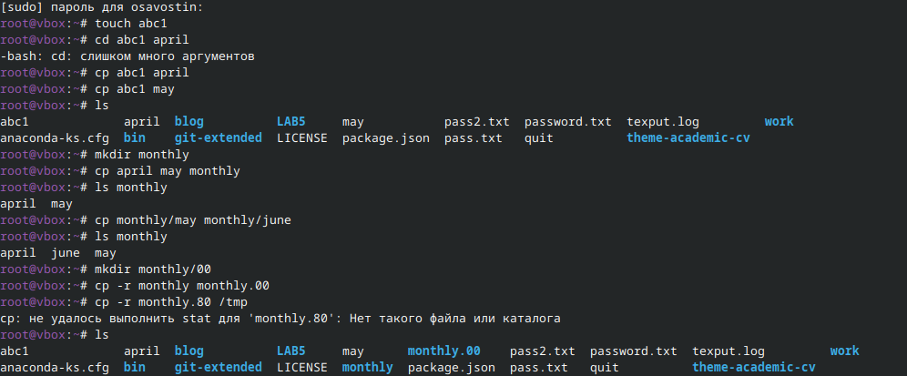{#fig:001 width=70%}

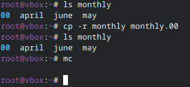{#fig:002 width=70%}

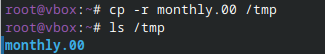{#fig:003 width=70%}

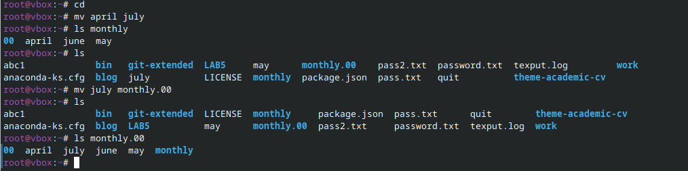{#fig:004 width=70%}

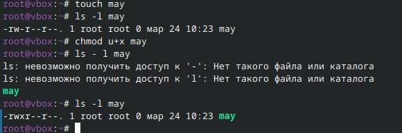{#fig:005 width=70%}

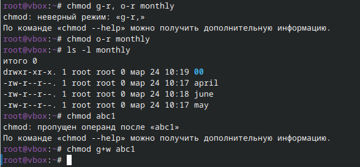{#fig:006 width=70%}

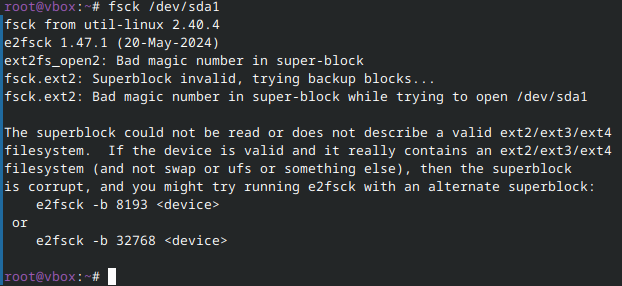{#fig:007 width=70%}

Выполняю вторую часть работы.(рис. [-@fig:008]) 

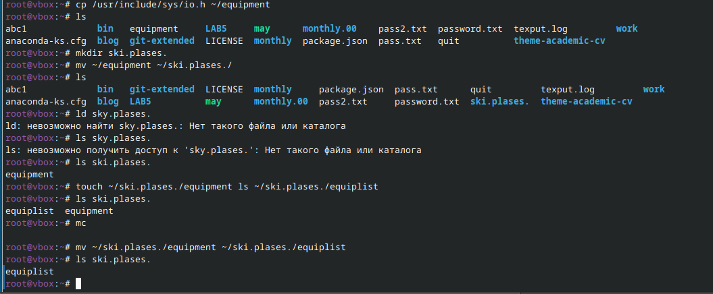{#fig:008 width=70%}

Следую указаниям в лабораторной работе (рис. [-@fig:009]) 

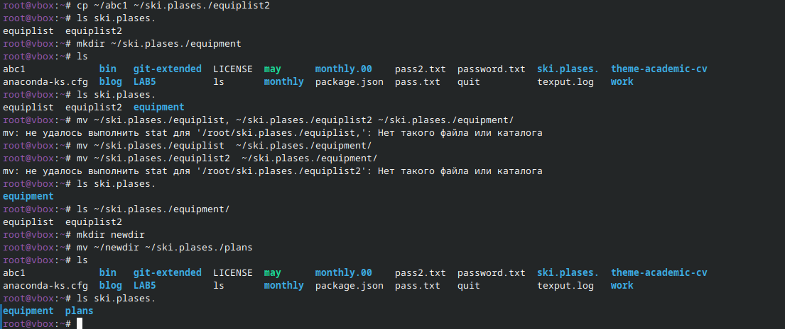{#fig:009 width=70%}

Выполняю команды на выдачу конкретных прав для файлов (рис. [-@fig:010]) 

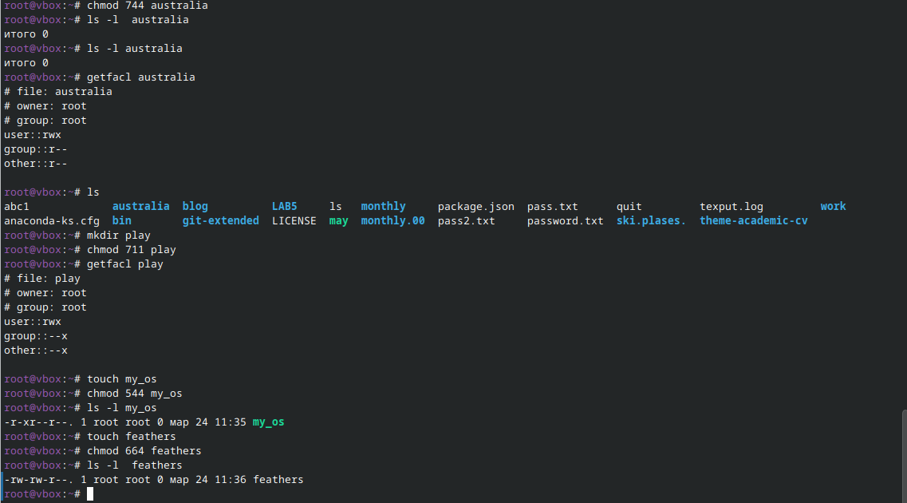{#fig:010 width=70%}

Проверяю содержимое файла passwd(рис. [-@fig:011]) 

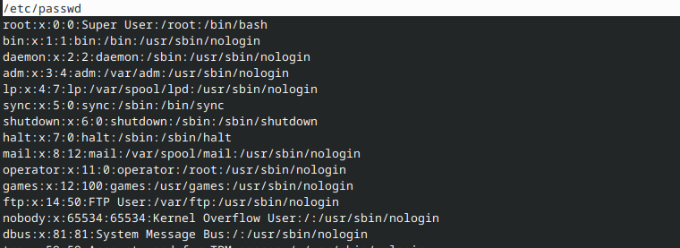{#fig:011 width=70%}

Завершаю выполнение задач (рис. [-@fig:012]) 

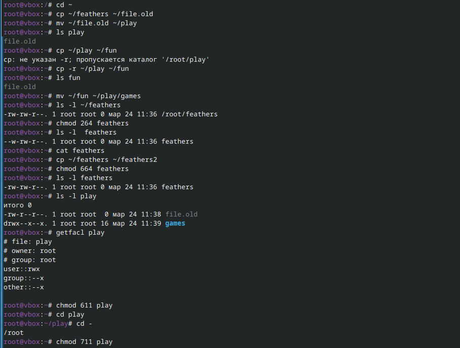{#fig:012 width=70%}

Теперь проверяю что делают команды fsck mount mkfs kill (рис. [-@fig:013]) (рис. [-@fig:014]) (рис. [-@fig:015]) (рис. [-@fig:016]) 

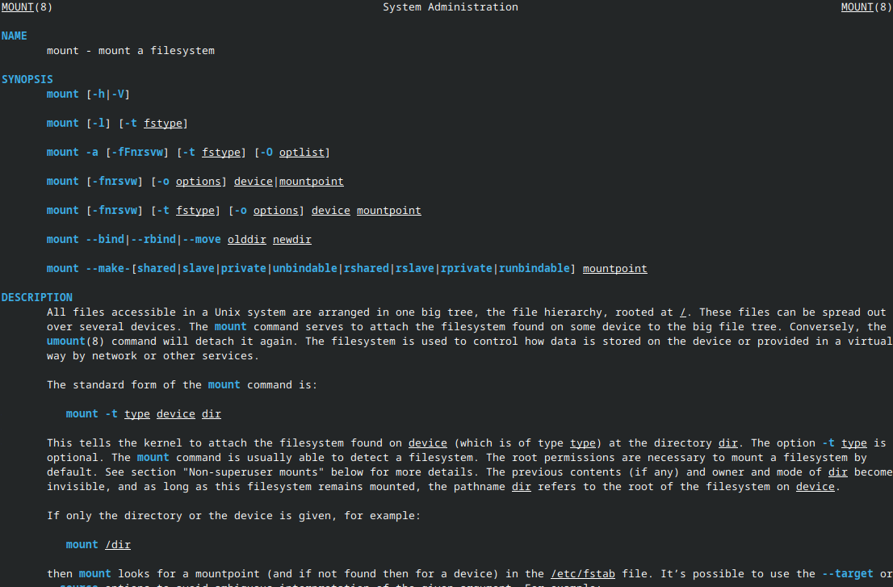{#fig:013 width=70%}

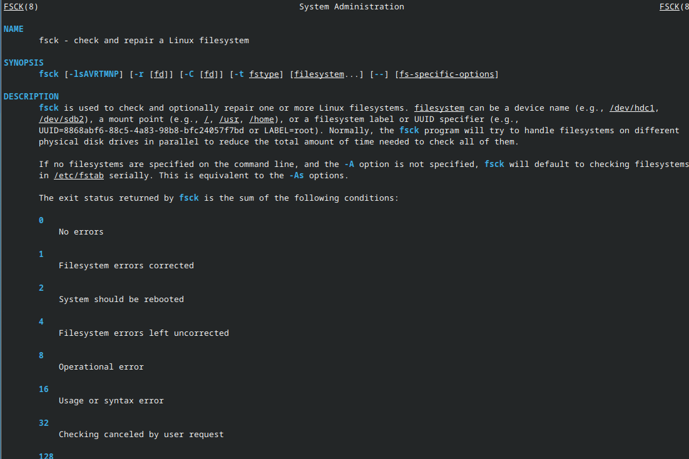{#fig:014 width=70%}

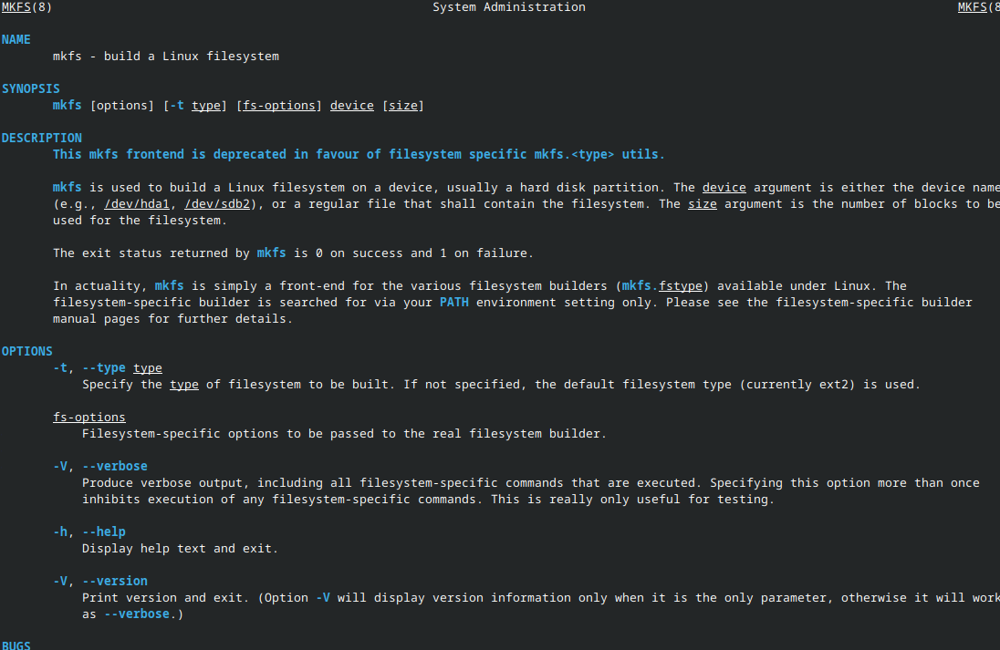{#fig:015 width=70%}

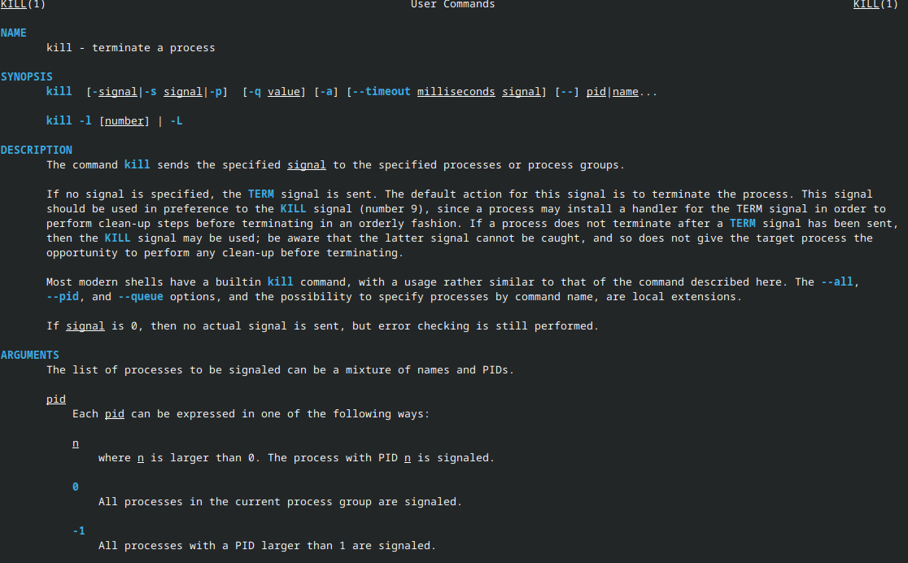{#fig:016 width=70%}

# Выводы

В ходе данной лабораторной работы я освоил навыки пользования файловой системой Linux, её структурой, именами и содержанием каталогов

# Список литературы{.unnumbered}

Лабораторная работа 7
::: {#refs}
:::
