---
## Front matter
lang: ru-RU
title: "Лабораторная работа №3"
subtitle: "Дисциплина: Операционные системы"
author: 
  - Савостин Олег
institute:
  - Российский университет дружбы народов, Москва, Россия

## i18n babel
babel-lang: russian
babel-otherlangs: english

## Formatting pdf
toc: false
toc-title: Содержание
slide_level: 2
aspectratio: 169
section-titles: true
theme: metropolis
header-includes:
 - \metroset{progressbar=frametitle,sectionpage=progressbar,numbering=fraction}
---

# Информация

## Докладчик

:::::::::::::: {.columns align=center}
::: {.column width="70%"}

  * Савостин Олег
  * студент Физики-математического факультета, Математика и Механика.
  * Российский университет дружбы народов
  * [1032245472@pfur..ru](mailto:1032245472@pfur.ru)

:::
::::::::::::::

# Цель работы

Целью работы является ознакомление с инструментами поиска файлов и фильтрации текстовых данных. Приобретение практических навыков: по управлению процессами (и заданиями), по
проверке использования диска и обслуживанию файловых систем

# Задание

1. Выполнение указаний в лабораторной работе 

# Теоретическое введение

В системе по умолчанию открыто три специальных потока:
– stdin — стандартный поток ввода (по умолчанию: клавиатура), файловый дескриптор
0;
– stdout — стандартный поток вывода (по умолчанию: консоль), файловый дескриптор
1;
– stderr — стандартный поток вывод сообщений об ошибках (по умолчанию: консоль),
файловый дескриптор 2.

## Теоретическое введение

Большинство используемых в консоли команд и программ записывают результаты
своей работы в стандартный поток вывода stdout. Например, команда ls выводит в стан-
дартный поток вывода (консоль) список файлов в текущей директории. Потоки вывода
и ввода можно перенаправлять на другие файлы или устройства. Проще всего это делается
с помощью символов >, >>, <, <<. Рассмотрим пример.
1 # Перенаправление stdout (вывода) в файл.
2 # Если файл отсутствовал, то он создаётся,
3 # иначе -- перезаписывается.

## Теоретическое введение

4
5 # Создаёт файл, содержащий список дерева каталогов.
6 ls -lR > dir-tree.list
7
8 1>filename
9 # Перенаправление вывода (stdout) в файл "filename".
10 1>>filename
11 # Перенаправление вывода (stdout) в файл "filename",
12 # файл открывается в режиме добавления.
13 2>filename
14 # Перенаправление stderr в файл "filename".
15 2>>filename
16 # Перенаправление stderr в файл "filename",
17 # файл открывается в режиме добавления.
18 &>filename
19 # Перенаправление stdout и stderr в файл "filename".
56 Лабораторная работа № 6. Поиск файлов. Перенаправление ввода-вывода. Просмотр …
6.2.2. Конвейер
Конвейер (pipe) служит для объединения простых команд или утилит в цепочки, в ко-
торых результат работы предыдущей команды передаётся последующей. Синтаксис
следующий:
1 команда 1 | команда 2
2 # означает, что вывод команды 1 передастся на ввод команде 2

## Теоретическое введение

Конвейеры можно группировать в цепочки и выводить с помощью перенаправления
в файл, например:
1 ls -la |sort > sortilg_list
вывод команды ls -la передаётся команде сортировки sort\verb, которая пишет ре-
зультат в файл sorting_list\verb.
Чаще всего скрипты на Bash используются в качестве автоматизации каких-то рутин-
ных операций в консоли, отсюда иногда возникает необходимость в обработке stdout
одной команды и передача на stdin другой команде, при этом результат выполнения
команды должен обработан

# Выполнение лабораторной работы

Создаю файл, в котором записано каждое название файлов в папке /etc одной командой (рис. [-@fig:001]) (рис. [-@fig:002]).

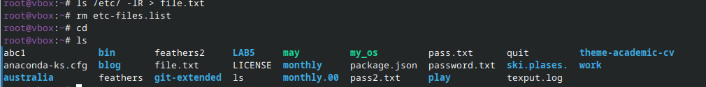{#fig:001 width=70%}

## Выполнение лабораторной работы

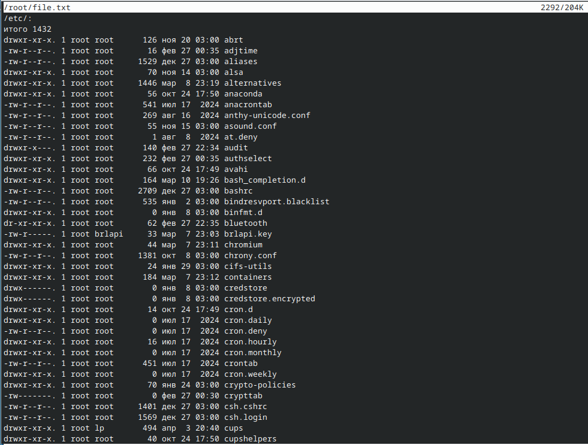{#fig:002 width=70%}

## Выполнение лабораторной работы

Добавляю в файл название файлов в домашнем каталоге (рис. [-@fig:003]) (рис. [-@fig:004]).

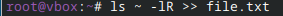{#fig:003 width=70%}

## Выполнение лабораторной работы

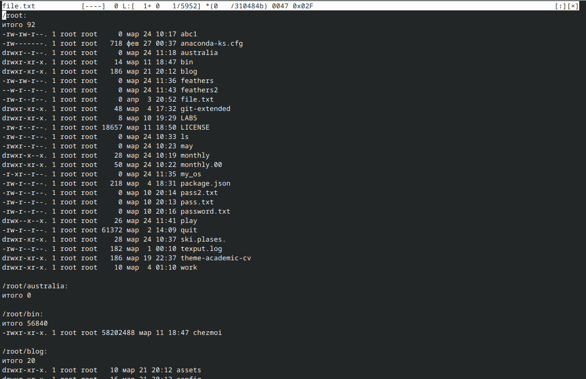{#fig:004 width=70%}

## Выполнение лабораторной работы

Копирую все слова в файле file.txt, заканчивающиеся на .conf в новый файл conf.txt (рис. [-@fig:005]) (рис. [-@fig:006]).

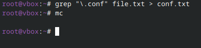{#fig:005 width=70%}

## Выполнение лабораторной работы

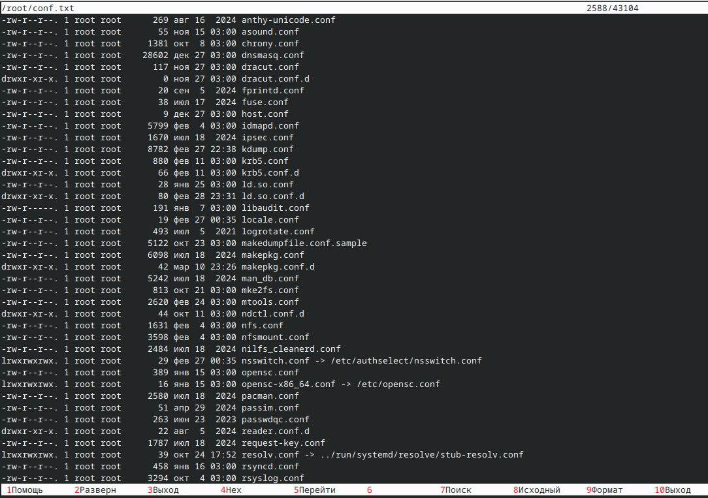{#fig:006 width=70%} 

## Выполнение лабораторной работы

Ищу все файлы, начинающиеся на с в домашнем каталоге (рис. [-@fig:007]).

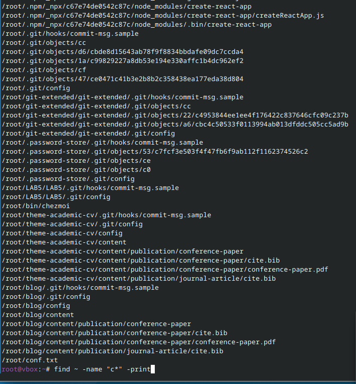{#fig:007 width=70%}

## Выполнение лабораторной работы

Ищу все файлы, начинающиеся на h в каталоге etc (рис. [-@fig:008]).

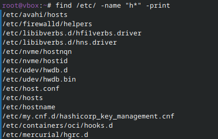{#fig:008 width=70%}

## Выполнение лабораторной работы

Запускаю в фоновом режиме команду записывания названий файлов -log в logfile.txt и затем удаляю файл (рис. [-@fig:009]) (рис. [-@fig:010]).

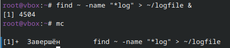{#fig:009 width=70%}

## Выполнение лабораторной работы

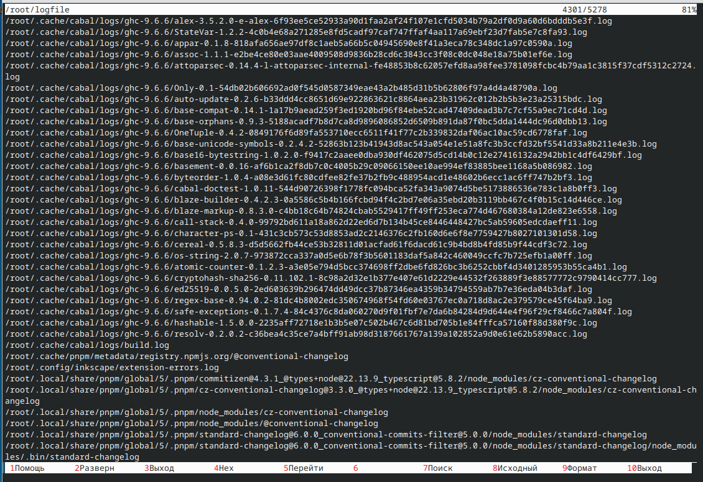{#fig:010 width=70%}

## Выполнение лабораторной работы

Запускаю текстовой редактор в фоновом режиме. Узнаю индекс программы - 5070 и завершаю его (рис. [-@fig:011]).

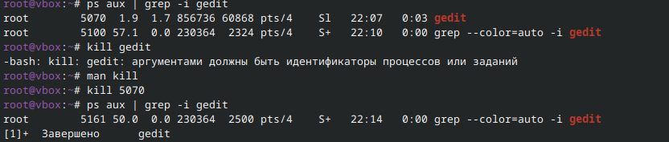{#fig:011 width=70%}

## Выполнение лабораторной работы

Вывожу на экран все каталоги в домашнем каталоге (рис. [-@fig:012]).

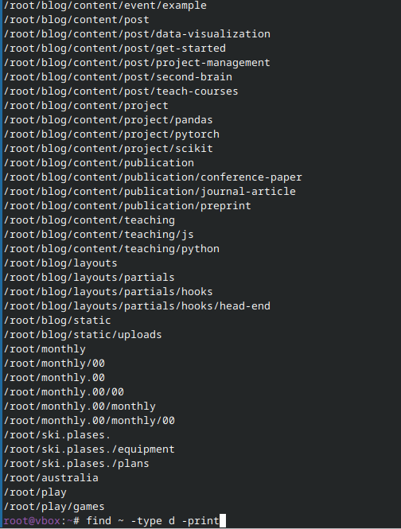{#fig:012 width=70%}

# Выводы

В ходе работы были завершены ознакомление с инструментами поиска файлов и фильтрации текстовых данных приобретение практических навыков: по управлению процессами (и заданиями), по проверке использования диска и обслуживанию файловых систем

# Список литературы{.unnumbered}

Лабораторная работа №8
::: {#refs}
:::
