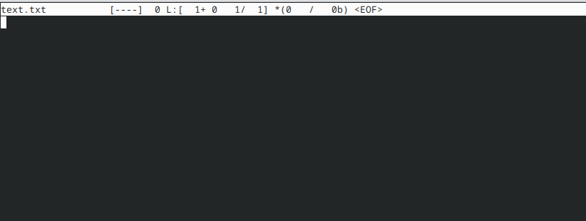

---
## Front matter
lang: ru-RU
title: "Лабораторная работа №3"
subtitle: "Дисциплина: Операционные системы"
author: 
  - Савостин Олег
institute:
  - Российский университет дружбы народов, Москва, Россия

## i18n babel
babel-lang: russian
babel-otherlangs: english

## Formatting pdf
toc: false
toc-title: Содержание
slide_level: 2
aspectratio: 169
section-titles: true
theme: metropolis
header-includes:
 - \metroset{progressbar=frametitle,sectionpage=progressbar,numbering=fraction}
---

# Информация

## Докладчик

:::::::::::::: {.columns align=center}
::: {.column width="70%"}

  * Савостин Олег
  * студент Физики-математического факультета, Математика и Механика.
  * Российский университет дружбы народов
  * [1032245472@pfur..ru](mailto:1032245472@pfur.ru)

:::
::::::::::::::

# Выполнение лабораторной работы

## МС

Изучаю информацию о mc (рис. [-@fig:001]).

{#fig:001 width=70%}

## МС

Изучаю мс в терминале (рис. [-@fig:002]).

{#fig:002 width=70%}

## МС

Выполняю команды в мс(рис. [-@fig:003]) (рис. [-@fig:004]).

{#fig:003 width=70%}

## МС

{#fig:004 width=70%}

## МС

Проверяю левую панель. Всё подробно (рис. [-@fig:005]).

{#fig:005 width=70%}

## МС

Открываю встроенный редактор мс и редактирую файл (рис. [-@fig:006])(рис. [-@fig:007]).

{#fig:006 width=70%}

## МС

{#fig:007 width=70%}

## МС

Использую функцию создание каталога(рис. [-@fig:008]) (рис. [-@fig:009]).

{#fig:008 width=70%}

## МС

{#fig:009 width=70%}

## МС

Использую поиск файлов(рис. [-@fig:010]) (рис. [-@fig:011]).

{#fig:010 width=70%}

## МС

{#fig:011 width=70%}

## МС

Смотрю историю команд (рис. [-@fig:012]) и изучаю окно Команда (рис. [-@fig:013]).

{#fig:012 width=70%}

## МС

{#fig:013 width=70%}

## МС

Изучаю окно Настройки(рис. [-@fig:014]).

{#fig:014 width=70%}

## МС текстовый редактор

Создаю файл текстовой (рис. [-@fig:015]) и вставляю в него текст из интернета (рис. [-@fig:16]).

{#fig:015 width=70%}

## МС текстовый редактор

{#fig:016 width=70%}

Удаляю часть текста (рис. [-@fig:017]). Копирую строку (рис. [-@fig:018]). Перемещаю строку (рис. [-@fig:019]).

{#fig:017 width=70%}

## МС текстовый редактор

{#fig:018 width=70%}

## МС текстовый редактор

{#fig:019 width=70%}

# Выводы

Были освоены навыки с мс

# Список литературы{.unnumbered}

Лабораторная Работа Номер 9 РУДН
::: {#refs}
:::
