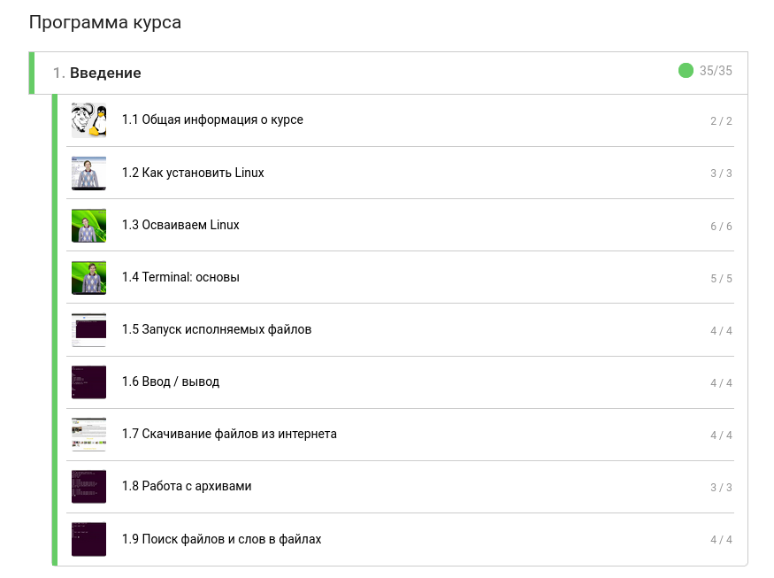
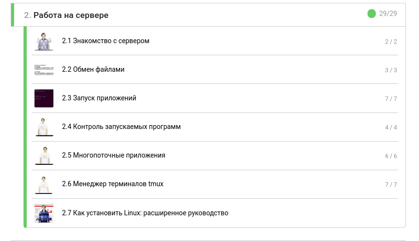
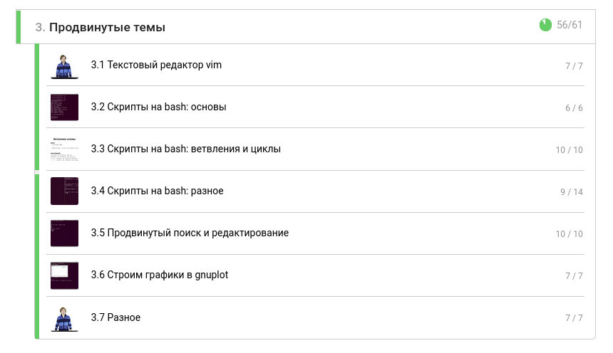
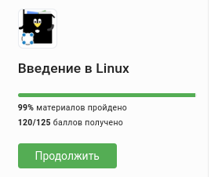

---
## Front matter
lang: ru-RU
title: "Прохождение внешнего курса"
subtitle: "Дисциплина: Операционные системы"
author: 
  - Савостин Олег
institute:
  - Российский университет дружбы народов, Москва, Россия

## i18n babel
babel-lang: russian
babel-otherlangs: english

## Formatting pdf
toc: false
toc-title: Содержание
slide_level: 2
aspectratio: 169
section-titles: true
theme: metropolis
header-includes:
 - \metroset{progressbar=frametitle,sectionpage=progressbar,numbering=fraction}
---

# Информация

## Докладчик

:::::::::::::: {.columns align=center}
::: {.column width="70%"}

  * Савостин Олег
  * студент Физики-математического факультета, Математика и Механика.
  * Российский университет дружбы народов
  * [1032245472@pfur..ru](mailto:1032245472@pfur.ru)

:::
::::::::::::::

# Цель работы

Целью данной работы является освоение базовых знаний в ОС Linux и пройти внешний курс на Stepik.

# Задание

Пройти курс и получить сертификат.

# Первая часть курса

Сперва прохожу первую часть программы курса - Введение. На данном этапе я осваиваю базовый функционал ОС и начинаю работать с интерфейсом, архивами, терминалом. Я освоил несколько полезных навыков с этого этапа курса, такие как запуск исполняемых файлов, скачивание файлов с интернета на Linux и поиск определенных слов в текстовых файлов. Данные навыки помогают более эффективно работать и понять, почему большинство программистов предпочитают Linux вместо Windows (рис. [-@fig:001]).

# Первая часть курса

{#fig:001 width=70%}

# Вторая часть курса

Приступаю ко второму этапу, который является сложнее, чем первый этап.На этом этапе курса, я освоил работу на сервере. Я научился выполнять обмен файлами, запуск определенных файлов, контролировать запускаемые программы. Также я освоил Менеджер терминалов tmux (рис. [-@fig:002]).

# Вторая часть курса

{#fig:002 width=70%}

# Третья часть курса

Финальный этап - продвинутые темы является самым трудным для освоения в этом курсе, но помогает новому пользователю свободно работать с ОС Linux. На этом этапе, в задачах были вопросы не только по определениям, но также работа со встроенным терминалом. Надо было писать разные скрипты, выполняющие некоторые действия. Это были скрипты на bash. Я изучил ветвления и циклы. Также научился строить графики в gnuplot. Этот этап курса является самым полезным и интересным по своему содержанию и помогает лучше освоить скрипты. (рис. [-@fig:003]).

# Третья часть курса

{#fig:003 width=70%}

# Итог

Результат (рис. [-@fig:004]).

{#fig:004 width=70%}

# Выводы

В итоге, я набрал 120 баллов из 125 за данный курс и получил свой сертификат. Этот курс был очень интересным и помог мне лучше освоить работы в ОС Linux

# Список литературы{.unnumbered}

::: {#refs}
:::
